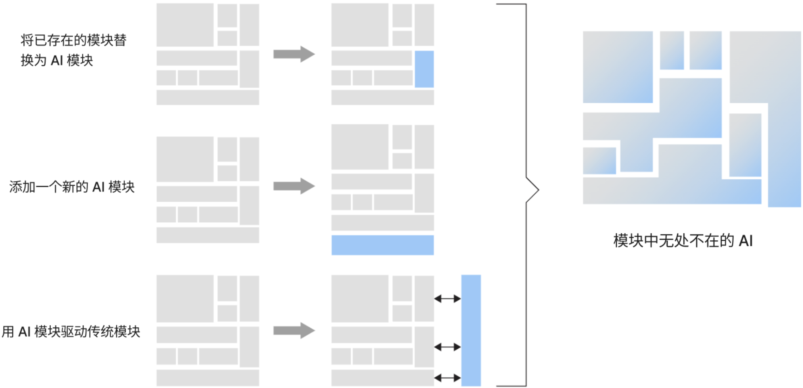
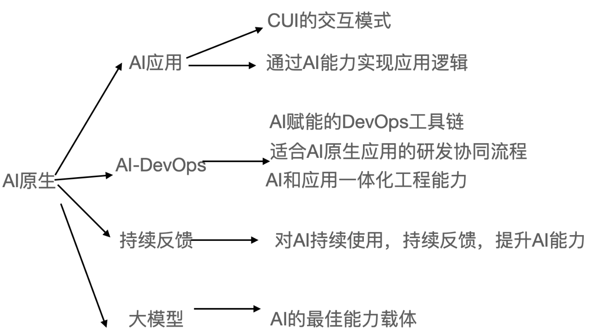
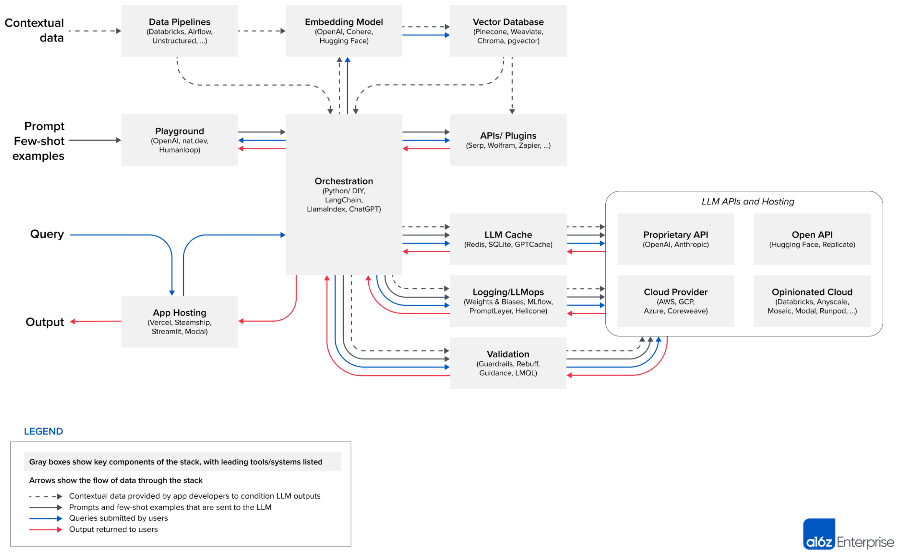
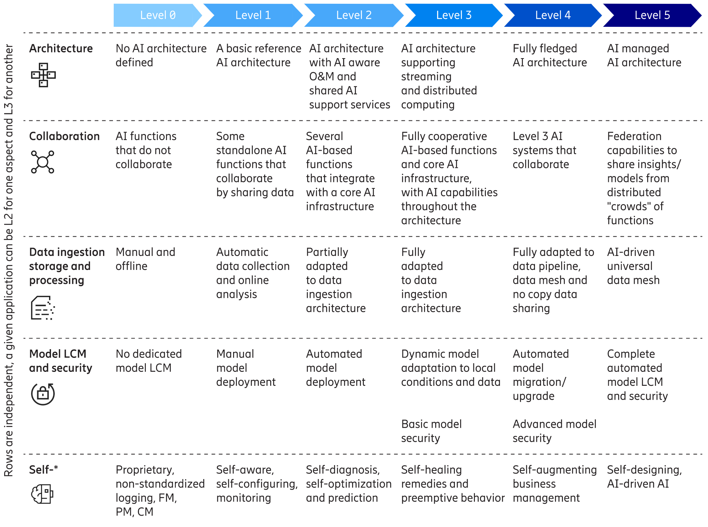

# AI 原生知识进阶

## 应用概念

AI原生应用（AI Native）思维是一种基于AI构建和运行应用程序的方法，是一套技术体系和方法论。AI表示应用程序需要更好的利用AI能力和适应AI，而不是传统的AI来适应人；Native表示应用程序从设计之初即考虑到AI的应用和能力，原生为AI而设计，在用好AI以最佳姿势运行，充分利用和发挥AI大模型的智能+CUI优势，提高应用程序的智能化水平。

## 基本概念
   目前，人工智能技术已经成熟，现在被认为是稳定的，最先进的技术被用来解决许多类型的难题。 AI 技术在存在固有随机性和非确定性的情况下表现出色，并且在可用数据中捕获模式和相关性的复杂性（有时基于非常复杂的输入）需要付出大量努力才能被人类专业知识驯服。在这些情况下，人工智能技术可以在可用数据上进行训练，然后学习表示和预测数据中的固有行为。
为了解决“AI原生”这一术语缺乏清晰定义的问题，首先需要澄清该术语的使用方式。"AI原生"通常作为一个前缀，用于修饰诸如系统、功能或实现等实体，例如一个更具体的实体，比如特定的功能或接口。无论该前缀用于哪个实体，可以认为高层次的"AI原生"概念保持一致，它包括在实体的所有子组件中普遍使用AI和必要的数据基础设施，而不是将基于AI的组件添加到现有的非AI实体中。 

```
从实现的角度来看，添加AI能力到一个系统可以采用不同的方法：
- 第一种方法是用 AI 技术替换已有的功能模块，比较方便对比替换前后的收益
- 第二种方法是添加一个全新的基于 AI 的模块，这种模块没有任何历史包袱，适合在探索性项目中应用
- 第三种方法是添加一个基于 AI 的模块，由它驱动传统模块，就像一个Sidecar，在传统模块之上，提供基于 AI 的自动化、优化或额外的功能
```



 但无论是简单地使用 AI 替换一个、多个或所有模块中的现有功能，甚至添加新功能，这些并不能实现严格意义上的 AI Native，类比到应用架构中：AI 应该和代码、数据一样成为一等公民，即无代码、不编程；无 AI、不工作。一等公民可以在整个架构中横向、纵向使用，而不仅限于某一层，数据基础设施也是如此，数据和知识需要跨层共享，AI 技术也可以应用于每一层甚至跨层，以实现架构中无处不在的智能。

## AI原生应用概念简要定义
AI原生应用是指在设计、开发、部署、运营和维护过程中，具有内在安全、可信的AI能力应用，其中AI是功能的自然组成部分。 实现一个AI原生应用的过程，往往需要利用数据驱动和基于知识的生态系统，在这一过程中，数据与知识将被消费和生产，以实现新的基于AI的原生功能。在需要时通过学习和自适应的AI增强能力，来替代以往静态的、基于规则的机制。

- AI原生与基于AI的区别
```
- AI原生：指将 AI 嵌入其核心，如果AI不是产品的一部分，产品就不会存在。
- 基于AI：指使用AI为用户提供新功能，从这个方面看，AI就是一个附加组件。
```
## AI原生应用的架构
AI 原生应用环境中的一个重要目标是以 AI 为中心的应用架构，它是一种AI遍及整个架构的形态，代表着应用架构全面拥抱大模型的应用范式，应用Model as A Service（AI as A Service），通过模型能力组织系统架构（以AI为中心的应用架构），将模型、后端、前端放在同等地位，共同构成完整的系统架构。

```
AI原生应用的架构主要分为三层：应用层、算法层、平台层。
- 应用层：应用层是AI原生应用的核心，主要负责业务需求的定义、业务逻辑的实现、数据处理的流转、以及应用的运行和管理。
- 算法层：算法层是AI原生应用的核心，主要负责算法的设计、训练、优化、部署、以及模型的管理。
- 平台层：平台层是AI原生应用的支撑，主要负责云端平台的选择、容器化的部署、以及应用的监控和管理。
- 模型层：模型层是AI原生应用的核心，主要负责模型的训练、优化、部署、以及模型的管理。
- 数据层：数据层是AI原生应用的核心，主要负责数据的采集、清洗、转换、存储、以及数据的管理。
- 工具层：工具层是AI原生应用的核心，主要负责工具包的选择、集成、以及工具的管理。
- 测试层：测试层是AI原生应用的核心，主要负责测试的准备、执行、以及测试的评估。
- 部署层：部署层是AI原生应用的核心，主要负责应用的部署、运维、以及应用的管理。
- 监控层：监控层是AI原生应用的核心，主要负责应用的监控、报警、以及应用的管理。
```

- AI原生思维链


- AI原生架构图


### 应用层

应用层主要负责业务需求的定义、业务逻辑的实现、数据处理的流转、以及应用的运行和管理。
```
- 业务需求定义：应用层的核心是业务需求的定义，包括业务目标、用户场景、业务流程、数据需求、以及应用的功能。
- 业务逻辑实现：应用层的核心是业务逻辑的实现，包括应用的功能模块、数据处理流程、以及应用的运行和管理。
- 数据处理流转：应用层的核心是数据处理的流转，包括数据采集、清洗、转换、存储、以及数据的管理。
- 应用运行和管理：应用层的核心是应用的运行和管理，包括应用的部署、运维、以及应用的管理。
```

### 算法层

算法层主要负责算法的设计、训练、优化、部署、以及模型的管理。
```
- 算法设计：算法层的核心是算法的设计，包括算法的选择、设计、优化、以及部署。
- 算法训练：算法层的核心是算法的训练，包括算法的训练数据、模型的训练、以及模型的优化。
- 算法优化：算法层的核心是算法的优化，包括算法的调参、模型的压缩、以及模型的部署。
- 模型管理：算法层的核心是模型的管理，包括模型的存储、部署、以及模型的管理。
```
### 平台层

平台层主要负责云端平台的选择、容器化的部署、以及应用的监控和管理。
```
- 云端平台选择：平台层的核心是云端平台的选择，包括云端平台的选择、容器化的部署、以及应用的监控。
- 容器化部署：平台层的核心是容器化的部署，包括容器的选择、部署、以及应用的监控。
- 应用监控：平台层的核心是应用的监控，包括应用的日志、监控、报警、以及应用的管理。
```
### 模型层

模型层主要负责模型的训练、优化、部署、以及模型的管理。
```
- 模型训练：模型层的核心是模型的训练，包括模型的训练数据、模型的训练、以及模型的优化。
- 模型优化：模型层的核心是模型的优化，包括模型的压缩、以及模型的部署。
- 模型部署：模型层的核心是模型的部署，包括模型的存储、部署、以及模型的管理。
```

### 数据层

数据层主要负责数据的采集、清洗、转换、存储、以及数据的管理。
```
- 数据采集：数据层的核心是数据的采集，包括数据采集的定义、采集方式、以及数据采集的质量。
- 数据清洗：数据层的核心是数据的清洗，包括数据清洗的定义、清洗方式、以及数据清洗的质量。
- 数据转换：数据层的核心是数据的转换，包括数据转换的定义、转换方式、以及数据转换的质量。
- 数据存储：数据层的核心是数据的存储，包括数据的存储方式、存储位置、以及数据的备份。
- 数据管理：数据层的核心是数据的管理，包括数据的备份、数据质量的监控、以及数据安全的保护。
```

### 工具层

工具层主要负责工具包的选择、集成、以及工具的管理。
```
- 工具包选择：工具层的核心是工具包的选择，包括工具包的选择、集成、以及工具的管理。
- 工具集成：工具层的核心是工具的集成，包括工具的集成方式、集成工具、以及工具的管理。
- 工具管理：工具层的核心是工具的管理，包括工具的版本管理、工具的更新、以及工具的安全性。
```
### 测试层

测试层主要负责测试的准备、执行、以及测试的评估。
```
- 测试准备：测试层的核心是测试的准备，包括测试的准备、测试的执行、以及测试的评估。
- 测试执行：测试层的核心是测试的执行，包括测试的执行方式、测试的结果、以及测试的评估。
- 测试评估：测试层的核心是测试的评估，包括测试的评估方式、测试的结果、以及测试的改进。
```

### 部署层

部署层主要负责应用的部署、运维、以及应用的管理。
```
- 应用部署：部署层的核心是应用的部署，包括应用的部署方式、部署环境、以及应用的运维。
- 应用运维：部署层的核心是应用的运维，包括应用的运维方式、运维工具、以及应用的管理。
- 应用管理：部署层的核心是应用的管理，包括应用的管理方式、应用的配置、以及应用的安全性。
```

### 监控层

监控层主要负责应用的监控、报警、以及应用的管理。
```
- 应用监控：监控层的核心是应用的监控，包括应用的日志、监控、报警、以及应用的管理。
- 应用报警：监控层的核心是应用的报警，包括应用的报警方式、报警策略、以及报警的管理。
- 应用管理：监控层的核心是应用的管理，包括应用的管理方式、应用的配置、以及应用的安全性。
```

## 设计模式

- 设计模式 In-context learning（情境学习）

情境学习（In-context learning）是一种基于AI的应用模式，它通过学习用户的实际场景，来改进AI模型的性能。这种模式的核心是将用户的实际场景作为输入，通过学习用户的场景，来改进AI模型的性能。这种模式的优势在于，它可以帮助AI模型更好地理解用户的需求，提升模型的准确性和效率。



- 设计模式 Out-of-context learning（非情境学习）

非情境学习（Out-of-context learning）是一种基于AI的应用模式，它通过学习用户的非实际场景，来改进AI模型的性能。这种模式的核心是将用户的非实际场景作为输入，通过学习用户的非实际场景，来改进AI模型的性能。这种模式的优势在于，它可以帮助AI模型更好地理解用户的需求，提升模型的准确性和效率。

- 设计模式 Hybrid learning（混合学习）

混合学习（Hybrid learning）是一种基于AI的应用模式，它通过结合用户的实际场景和非实际场景，来改进AI模型的性能。这种模式的核心是将用户的实际场景和非实际场景作为输入，通过结合用户的实际场景和非实际场景，来改进AI模型的性能。这种模式的优势在于，它可以帮助AI模型更好地理解用户的需求，提升模型的准确性和效率。

- 设计模式 Model as a Service（模型即服务）

模型即服务（Model as a Service）是一种基于AI的应用模式，它通过云端服务的方式，提供模型的训练、部署、以及模型的管理。这种模式的核心是将模型作为云端服务，通过云端服务的方式，提供模型的训练、部署、以及模型的管理。这种模式的优势在于，它可以帮助AI模型更好地理解用户的需求，提升模型的准确性和效率。

- 设计模式 Model as a Function（模型即功能）

模型即功能（Model as a Function）是一种基于AI的应用模式，它通过将模型作为功能模块，来改进AI模型的性能。这种模式的核心是将模型作为功能模块，通过将模型作为功能模块，来改进AI模型的性能。这种模式的优势在于，它可以帮助AI模型更好地理解用户的需求，提升模型的准确性和效率。


## AI原生应用的关键技术

```
AI原生应用的关键技术主要包括：
- 机器学习：机器学习是AI原生应用的核心技术，包括深度学习、强化学习、强化学习、以及其他机器学习算法。
- 容器技术：容器技术是AI原生应用的核心技术，包括Docker、Kubernetes、以及其他容器技术。
- 云计算技术：云计算技术是AI原生应用的核心技术，包括云计算服务、云计算平台、以及其他云计算技术。
- 微服务架构：微服务架构是AI原生应用的核心技术，包括服务网格、服务注册、服务发现、以及其他微服务架构。
- 自动化运维：自动化运维是AI原生应用的核心技术，包括自动化部署、自动化运维、以及其他自动化运维技术。
- 监控告警：监控告警是AI原生应用的核心技术，包括日志、监控、报警、以及其他监控告警技术。
- 机器学习框架：机器学习框架是AI原生应用的核心技术，包括TensorFlow、PyTorch、以及其他机器学习框架。
- 数据库技术：数据库技术是AI原生应用的核心技术，包括关系型数据库、NoSQL数据库、以及其他数据库技术。
- 编程语言：编程语言是AI原生应用的核心技术，包括Java、Python、C++、以及其他编程语言。
- 工具包：工具包是AI原生应用的核心技术，包括开源工具包、商业工具包、以及其他工具包。
- 自动化测试：自动化测试是AI原生应用的核心技术，包括单元测试、集成测试、以及其他自动化测试技术。
- 云服务：云服务是AI原生应用的核心技术，包括云服务商、云服务平台、以及其他云服务。
- 容器编排技术：容器编排技术是AI原生应用的核心技术，包括Kubernetes、Docker Swarm、以及其他容器编排技术。
- 微服务框架：微服务框架是AI原生应用的核心技术，包括Spring Cloud、Dubbo、以及其他微服务框架。
- 云平台：云平台是AI原生应用的核心技术，包括公有云、私有云、以及其他云平台。
- 自动化工具：自动化工具是AI原生应用的核心技术，包括Ansible、Terraform、以及其他自动化工具。
- 机器学习平台：机器学习平台是AI原生应用的核心技术，包括Kubeflow、Apache MXNet、以及其他机器学习平台。
- 云服务商：云服务商是AI原生应用的核心技术，包括AWS、Azure、GCP、以及其他云服务商。
- 容器编排平台：容器编排平台是AI原生应用的核心技术，包括Kubernetes、Mesos、以及其他容器编排平台。
- 自动化测试工具：自动化测试工具是AI原生应用的核心技术，包括Jenkins、Selenium、以及其他自动化测试工具。
```

## AI原生应用成熟度模型（供参考）

   为了业务或产品在其AI原生应用之旅中提供指导，Ericsson开发了一个AI原生应用成熟度模型。该模型由五个级别的矩阵组成（L1到L5），另外还有一个级别为L0，表示非AI原生应用的水平。每个级别都有几个维度来进行系统评估，如架构、协作、数据摄取等，可以根据其AI原生程度进行分析。




## AI原生应用的优势

```
- 降低AI应用开发门槛：AI原生应用不需要复杂的算法和模型，只需要简单地定义业务需求，即可快速构建和部署。
- 降低AI应用部署难度：AI原生应用不需要复杂的部署环境，只需要在云端或本地环境部署容器化的AI模型，即可快速部署。
- 降低AI应用成本：AI原生应用不需要复杂的硬件和软件成本，只需要使用云端或本地环境部署容器化的AI模型，即可快速部署。
- 降低AI应用开发周期：AI原生应用不需要复杂的开发周期，只需要定义业务需求，即可快速构建和部署。
- 高度个性化的用户体验：通过AI对用户行为和偏好的分析，可以提供高度个性化的服务，增强用户体验。
- 提高效率和效果：AI可以帮助自动化和处理大量数据，从而减轻人工负担，提高工作效率。同时，通过机器学习和深度学习算法的优化，可以提高推荐和搜索结果的准确性，提高用户满意度。
- 开拓新的业务领域：AI技术的发展催生了许多新的业务领域，如智能客服、智能家居、自动驾驶等。通过AI原生应用的设计和开发，企业可以开拓新的业务领域，扩大业务范围。
```

## AI原生应用的需要考虑的因素

```
- 复杂性：AI原生应用的复杂性主要来自于算法和模型的复杂性，以及应用的业务需求的多样性。
- 兼容性：AI原生应用需要与各种设备、操作系统和软件进行兼容，包括移动设备、桌面电脑、云端平台等。
- 性能：AI原生应用的性能主要取决于算法和模型的性能，以及云端平台的性能。
- 隐私和安全：AI原生应用需要收集和使用大量的个人数据，以进行机器学习和优化算法。如果不加以妥善管理和保护，可能会导致个人隐私泄露和数据滥用的风险。
- 决策过程不透明：AI原生应用的决策过程往往基于复杂的算法和模型，这些算法和模型的决策过程通常难以解释和理解。这可能导致用户无法理解应用为何做出特定的决策，从而引发一些争议和不满。
- 偏见和不公平性：由于AI技术的训练数据来源于人类的数据，如果这些数据存在偏见和不公平性，AI原生应用可能会继承和放大这些偏见。这可能导致应用在某些情况下做出不公正或歧视性的决策，影响用户体验和社会公正性。
- 技术更新和维护成本：AI原生应用需要不断更新和维护以保持其功能和性能。然而，由于AI技术的复杂性和快速发展，这可能需要大量的时间和资源来投入。这可能导致应用的开发和维护成本增加，同时也可能增加用户的使用成本。
```

## 应用场景

```
- 图像识别：图像识别是AI原生应用的典型场景，通过计算机视觉技术，可以识别图像中的物体、场景、人脸、文字等信息，并进行智能分析。如通过图像识别，可以帮助企业快速识别客户的需求，提升产品的竞争力。
- 语音识别：语音识别是AI原生应用的另一种典型场景，通过语音识别技术，可以识别用户的语音，并进行智能分析。如通过语音识别，可以帮助企业快速响应客户的需求，提升客户服务质量。
- 自然语言处理：自然语言处理是AI原生应用的另一种典型场景，通过自然语言理解技术，可以理解用户的意图、情绪、场景、语句等，并进行智能分析。如通过自然语言处理，可以帮助企业快速理解客户的需求，提升产品的用户体验。
- 推荐系统：推荐系统是AI原生应用的另一种典型场景，通过推荐算法，可以为用户推荐相关产品或服务，并进行智能推荐。如通过推荐系统，可以帮助企业快速发现用户的需求，提升产品的市场占有率。
- 智能客服：智能客服是AI原生应用的另一种典型场景，通过聊天机器人技术，可以实现智能客服，并进行智能回复。如通过智能客服，可以帮助企业快速响应客户的需求，提升客户服务质量。
- 自动驾驶：自动驾驶是AI原生应用的另一种典型场景，通过深度学习技术，可以实现汽车的自动驾驶，并进行智能控制。如通过自动驾驶，可以帮助企业提升效率，降低成本，提升竞争力。
- 虚拟现实：虚拟现实是AI原生应用的另一种典型场景，通过虚拟现实技术，可以实现虚拟现实应用，并进行智能控制。如通过虚拟现实，可以帮助企业提升用户的沉浸感，提升产品的用户体验。
```

## 总结
AI原生应用具有高度的个性化、高效率和高可用性，并且可以适应各种复杂的业务需求。但是，由于AI原生应用的复杂性和依赖性，需要 carefully consider its factors and scenarios.

## 参考资料

- [AI原生] AI原生应用概念

## 后续更新

本文档持续更新中，欢迎您持续关注，期待您的参与。

