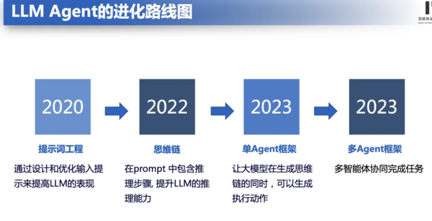
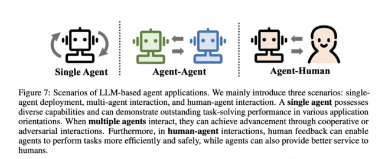
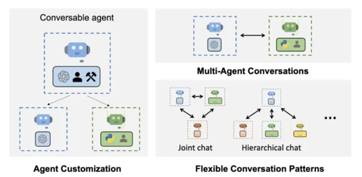

# Agent知识进阶

## 介绍

早在 1950 年代，Alan Turing 就将「智能」的概念扩展到了人工实体，并提出了著名的图灵测试。这些人工智能实体通常被称为 —— 代理（Agent）。「代理」这一概念起源于哲学，描述了一种拥有欲望、信念、意图以及采取行动能力的实体。斯坦福大学的一篇名为《Generative Agents: Interactive Simulacra of Human Behavior,titled》的论文深入研究了记忆、反应和计划的AI Agent。


## 什么是Agent
AI Agent 被认为是 OpenAI 发力的下一个方向。OpenAI 联合创始人 Andrej Karpathy 在近期的公开活动上说 “ 相比模型训练方法，OpenAI 内部目前更关注 Agent 领域的变化，每当有新的 AI Agents 论文出来的时候，内部都会很兴奋并且认真地讨论 ” 。

在人工智能领域，这一术语被赋予了一层新的含义：具有自主性、反应性、积极性和社交能力特征的智能实体。

AI Agent，它被设计为具有独立思考和行动能力的AI程序。你只需要提供一个目标，比如写一个游戏、开发一个网页，他就会根据环境的反应和独白的形式生成一个任务序列开始工作。就好像是人工智能可以自我提示反馈，不断发展和适应，以尽可能最好的方式来实现你给出的目标。



## 为什么需要AI Agent

为什么大语言模型（LLM）刚流行不久，就需要AI Agent呢？LLM与LangChain 等工具相结合，释放了内容生成、编码和分析方面的多种可能性，目前在ChatGPT插件中比较有代表性的插件就是code interpreter。在这方面的应用上Agent的概念应用发挥着举足轻重的作用。

这里可以将Agent视为人工智能大脑，它使用LLM进行推理、计划和采取行动。

语言模型 (LLM) 仅限于它们所训练的知识，并且这些知识很快就会过时。（每天用最新信息重新训练这么大的模型是不可行的。）

- LLM的一些缺点：
```
1、会产生幻觉。
2、结果并不总是真实的。
3、对时事的了解有限或一无所知。
4、很难应对复杂的计算。
```
这就是AI Agent的用武之地，它可以利用外部工具来克服这些限制。

这里的工具是什么呢？工具就是代理用它来完成特定任务的一个插件、一个集成API、一个代码库等等，例如：
```
1、Google搜索：获取最新信息
2、Python REPL：执行代码
3、Wolfram：进行复杂的计算
4、外部API：获取特定信息
```

## Agent的特点

AI Agent 能够做到以下几点：

1. 自主性：Agent 可以根据环境的变化，做出自己的决策。

2. 反应性：Agent 可以快速响应环境的变化，做出快速的决策。

3. 积极性：Agent 可以主动探索新的环境，寻找新的知识。

4. 社交能力：Agent 可以和其他 Agent 进行交流，学习和合作。

## Agent的功能

Agent 的功能可以分为以下几类：

1. 决策：Agent 根据环境的输入，做出决策。

2. 学习：Agent 学习环境的动态规划模型，提高决策的准确性。

3. 交流：Agent 可以和其他 Agent 进行交流，学习和合作。

4. 记忆：Agent 可以记住之前的经验，并在之后的决策中使用这些经验。

5. 计划：Agent 可以根据环境的输入，制定计划，并执行计划。

6. 反思：Agent 可以通过观察环境，分析环境，并思考环境。

7. 控制：Agent 可以控制其他Agent，协同完成任务。

8. 推理：Agent 可以利用外部工具来进行推理。

9. 行动：Agent 可以执行任务，并输出结果。

10. 奖励：Agent 可以根据任务的完成情况，给予奖励。

   

## Agent的架构

Agent 的架构可以分为以下几类：

1. 基于规则的Agent：基于规则的Agent 按照一定的规则，做出决策。

   

2. 基于模型的Agent：基于模型的Agent 学习环境的动态规划模型，做出决策。

3. 交互式Agent：交互式Agent 可以与用户进行交互，获取用户的输入，做出决策。

   

4. 多智能体Agent：多智能体Agent 可以同时控制多个Agent，协同完成任务。

   

5. 多任务Agent：多任务Agent 可以同时完成多个任务，提高整体的效率。

  

6. 强化学习Agent：强化学习Agent 学习环境的动态规划模型，通过与环境的交互，不断调整策略，使得策略能够更好地适应环境。

   

## Agent的状态存储（记忆）

在本文框架中，记忆模块（Memory）储存了代理过往的观察、思考和行动序列。通过特定的记忆机制，代理可以有效地反思并应用先前的策略，使其借鉴过去的经验来适应陌生的环境。

- 短期记忆：我认为所有的上下文学习（参见提示工程）都是利用模型的短期记忆来学习。

- 长期记忆：这为代理提供了长时间保留和回忆（无限）信息的能力，通常是通过利用外部向量存储和快速检索。

通常用于提升记忆能力的方法有四种：

- 扩展 Backbone 架构的长度限制：针对 Transformers 固有的序列长度限制问题进行改进。

- 总结记忆（Summarizing）：对记忆进行摘要总结，增强代理从记忆中提取关键细节的能力。

- 压缩记忆（Compressing）：通过使用向量或适当的数据结构对记忆进行压缩，可以提高记忆检索效率。

- 强化记忆（Reinforcement Learning）：引入类似计算机分层存储机制，强化记忆能力。

  

此外，记忆的检索方法也很重要，只有检索到合适的内容，代理才能够访问到最相关和准确的信息。


## 人类与AI的交互

人类与AI的交互可以分为以下几种：

1. 文本交互：人类与AI进行文本交互，主要是通过文本聊天、语音交互等方式。

2. 图像交互：人类与AI进行图像交互，主要是通过图像识别、图像生成等方式。

3. 视频交互：人类与AI进行视频交互，主要是通过视频监控、视频生成等方式。

4. 触觉交互：人类与AI进行触觉交互，主要是通过触觉控制、触觉识别等方式。

5. 体感交互：人类与AI进行体感交互，主要是通过体感控制、体感识别等方式。

   


## Agent的训练

Agent的训练是指Agent根据环境的反馈，不断调整策略，使得策略能够更好地适应环境。训练可以分为两个阶段：

1. 策略训练：Agent根据环境的反馈，调整策略参数，使得策略能够更好地适应环境。

2. 值函数训练：Agent根据策略的表现，调整值函数参数，使得策略能够更好地预测未来奖励。

## Agent的部署

Agent的部署是指将训练好的Agent部署到实际的应用场景中，让Agent在实际的环境中运行。部署可以分为以下几个步骤：

1. 环境搭建：搭建Agent运行的环境，包括环境的物理条件、Agent的初始状态、Agent的动作空间、Agent的观察空间等。

2. Agent加载：加载训练好的Agent模型，包括策略模型和值函数模型。

3. Agent运行：Agent根据环境的输入，执行动作，并接收环境的反馈。

4. 结果评估：Agent根据环境的反馈，评估Agent的表现。

5. 持续改进：根据Agent的表现，持续改进Agent的策略和值函数。

## 使用Agent需要注意的问题

- 稳定性问题

```
问题：
   1）LLM的输出不稳定，导致Agent执行过程的不稳定
   2）可能在某一个任务上陷入一个循环
描述：如果每个模块不稳定，难以开发成熟度高的 Agent应用，很难支持复杂任务。
解决方式：需要更强的底座模型，提升模型的稳定性，减少模型的不确定性。如：qianwen2.0-72B模型，支持多模态输入，支持多任务学习，支持多模态输出，支持多模态输入输出。
```

- 可用性问题

```
问题：
  1）Agent过长的prompt需求，带来很高的token消耗成本
  2）多Agent系统的token消耗更是惊人
描述：大模型调用成本过高，影响Agent的普及性。
解决方式：需要隆低大模型的推理成本，降低模型的调用成本。如：千问api降价、模型压缩、模型量化、模型加速等。
```

- 确定性问题

```
问题：Agent的输出不确定，导致任务失败或者更坏的结果
描述：在大模型幻觉问题没有解决前，是不可能让Agent去“接管〞世界的。
解决方式：通过强化学习、基于模型的Agent、多任务Agent等方法，提升Agent的确定性。
```

- 扩展性问题

```
问题：靠人力来写prompt，似乎是在重复符号主义AI的故事。
描述：通过人工编写prompt，却需要不断调优，像是走回了符号主义AI的老路。如：符号主义AI、专家系统、知识图谱。
解决方式：通过自动化的prompt生成工具，减少人工编写prompt的工作量，提升Agent的效率。如：大模型自动生成prompt、prompt-engineer、prompt-ops、prompt-ops-pro等。
```

## Agent 使用案例


## 总结

1. 状态存储是Agent的一个重要功能，它可以帮助Agent记住之前的经验，并在之后的决策中使用这些经验。

2. Agent的训练可以分为两个阶段：策略训练和值函数训练。

3. Agent的部署可以分为几个步骤：环境搭建、Agent加载、Agent运行、结果评估、持续改进。

4. 状态存储的实现方式有很多，常见的有基于记忆库的状态存储和基于模型的状态存储。

5. 值函数训练可以帮助Agent更好地预测未来奖励。

6. Agent的部署可以帮助Agent在实际的环境中运行，并持续改进策略和值函数。


## 后续更新

后续将会更新Agent的一些高级知识，包括Agent的强化学习、Agent的多智能体、Agent的多任务学习等。

## 参考资料

- [Reinforcement Learning: An Introduction](https://www.dropbox.com/s/b4879629962285/book2015oct.pdf?dl=0)
- [强化学习入门](https://morvanzhou.github.io/tutorials/machine-learning/reinforcement-learning/2-1-Q-Learning/)
- [强化学习算法汇总](https://zhuanlan.zhihu.com/p/26578694)
- [强化学习算法详解](https://zhuanlan.zhihu.com/p/26578694)
- [强化学习算法原理](https://zhuanlan.zhihu.com/p/26578694)
- [强化学习算法实践](https://zhuanlan.zhihu.com/p/26578694)
- [强化学习算法与应用](https://zhuanlan.zhihu.com/p/26578694)
- [Agent多智能体学习](https://zhuanlan.zhihu.com/p/26578694)
- [Agent多任务学习](https://zhuanlan.zhihu.com/p/26578694)
- [Agent的状态存储](https://zhuanlan.zhihu.com/p/26578694)
- [Agent的训练](https://zhuanlan.zhihu.com/p/26578694)
- [Agent的部署](https://zhuanlan.zhihu.com/p/26578694)
- [Agent的强化学习](https://zhuanlan.zhihu.com/p/26578694)

本文档持续更新中，欢迎您持续关注，期待您的参与。


