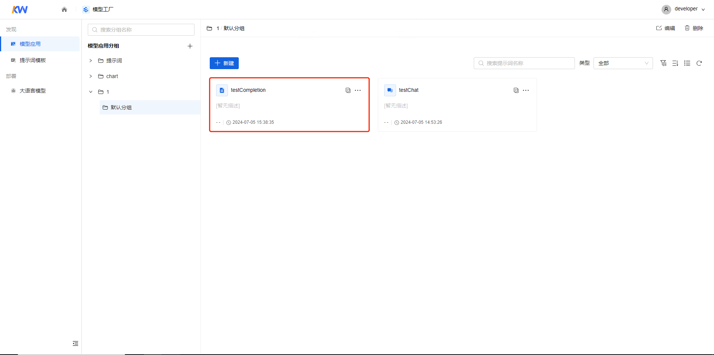
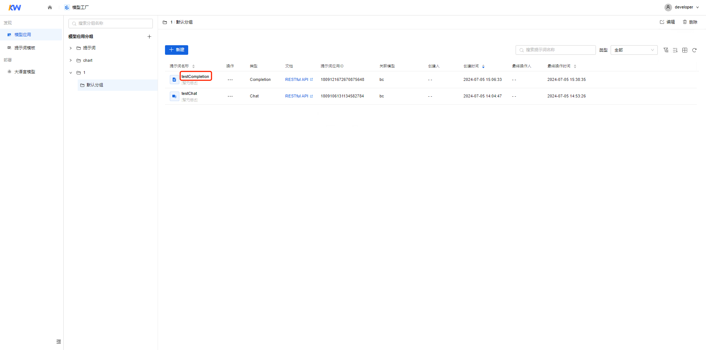

# 查看模型应用

[返回上级](../quick_start_mf.md#操作指引)

在“模型工厂>模型应用>新建模型应用”后，您可以查看保存后的模型应用信息。

1. 可以通过以下方式进入“模型应用查看”界面。

    卡片形式中：

    - 通过单击“模型应用卡片”方式。

    

    - 通过单击“操作>查看”按钮的方式。

    

    列表形式中：

    - 通过单击列表中“模型应用名称”方式。

    

    - 通过单击列表中“操作>查看”按钮的方式。

    

2. 在“模型应用查看”界面中，左侧提示词输入框、变量清单、对话开场白和模型均不可编辑。在“调试与预览”的用户输入中修改变量与调试结果。

    

3. 对调试与预览结果不满意，单击【编辑】按钮，界面变为编辑状态，编辑提示词详情请见“[新建模型应用](./create_model_app.md)”

    
