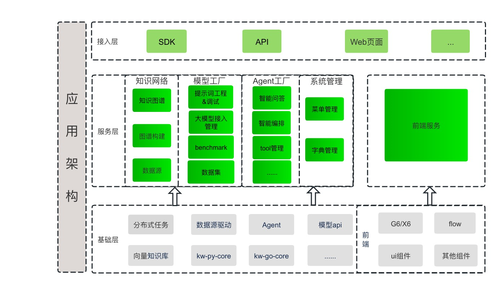
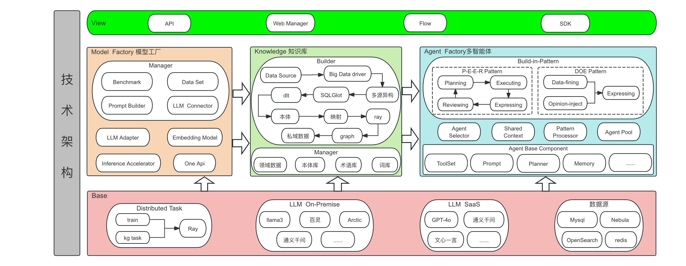

# KWeaver 架构介绍

KWeaver 是一个基于 Python 的开源项目，用于快速构建和部署机器学习模型。KWeaver 由以下几个主要组件构成：

- **KWeaver 服务器** ：KWeaver 服务器是一个基于 Python 的 Web 应用，用于管理机器学习模型的生命周期。它可以用来创建、训练、评估、部署和管理模型。
- **KWeaver 引擎** ：KWeaver 引擎是一个基于 Python 的库，用于构建、训练和部署机器学习模型。它可以用来构建、训练和部署模型，并提供模型评估和管理功能。
- **KWeaver 平台** ：KWeaver 平台是一个基于 Python 的 Web 应用，用于管理机器学习模型的生命周期。它可以用来创建、训练、评估、部署和管理模型。
- KWeaver 服务器和 KWeaver 平台可以部署在同一台服务器上，也可以部署在不同的服务器上。KWeaver 引擎可以部署在本地机器上，也可以部署在远程服务器上。

应用架构如下图所示：

技术架构如下图所示：

- 多源异构知识图谱：支持多源异构知识图谱，不同数据源可以来自不同的数据库多任务、多领域、多语言。可以将不同数据源的知识图谱融合到一起，形成统一的知识图谱。
- 多智能体（Agent）：提供多智能体开发框架和自定义编排工具，支持自定义智能体开发，支持多种类型的智能体。
- 数据集管理：用户可以在线管理数据集。数据集可以用于训练、评估和部署模型。支持多种数据格式，包括 文本、图像、音频等。
- Benchmark评测工具： 评测集管理，支持用户上传自己的评测集，并支持多种模型评测同时评测多个指标。支持多种模型评测方法，并记录相关性能指标，形成对应的评测报告。
- 图谱构建工具： 支持可视化图谱构建工具，用户可以在线构建知识图谱。通过LLM增强构建KG，并将KG用于增强LLM的预训练和推理。
- 任务调度中心：支持统一任务调度，用户可以创建、管理任务，并将任务分配给不同的智能体。
- 提示词工程&提示词生成: 提示词是一种自然语言指令，告诉大语言模型（LLM）执行什么任务。 通过角色+角色技能+任务核心关键词+任务目标+任务背景+任务范围+ 任务解决与否判定+任务限制条件+输出格式/形式+输出量+调试方式。
- 模型评估：模型评估是机器学习流程中用于确定训练模型性能的环节。它通过一系列定量指标，如准确率、召回率、F1分数、均方误差等，来衡量模型对测试数据的预测能力。此外，模型评估还包括对模型泛化能力的测试，确保其在未见过的数据分析上也能表现出色。常用的评估方法有交叉验证、引导方法等，旨在为模型的实用性和可靠性提供全面评价。
- 模型训练：支持用户自定义训练数据集，调整参数来训练模型，使其能更好地满足业务数据分析的需求。用户可以基于大模型的基础版本进行微调，也可以选择已微调的模型进一步进行微调。以及接入LLaMA-Factory，支持模型训练的自动化。
- One Api接口：提供统一模型调用接口管理。用户可以调用 One Api 接口，向模型发送请求，获取模型的预测结果。
- 模型监控：接入SwanLab的模型监控系统，支持模型监控，用户可以实时监控模型的运行情况，包括模型的训练进度、评估结果、预测结果等。
- 数据标注：接入Label Studio标注工具，支持用户自定义标注数据集和标注任务，并将标注结果导入到数据集中，用于模型训练。
- APP：AI原生应用，智能问答。

## 后续更新

本文档持续更新中，欢迎您持续关注，期待您的参与。
