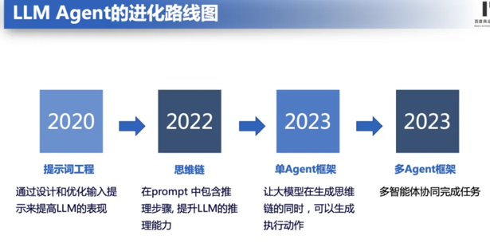
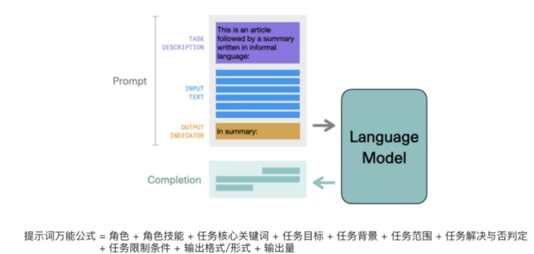
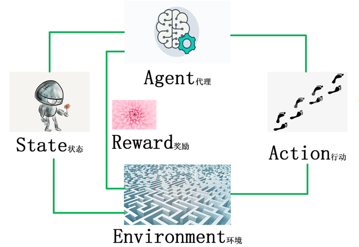
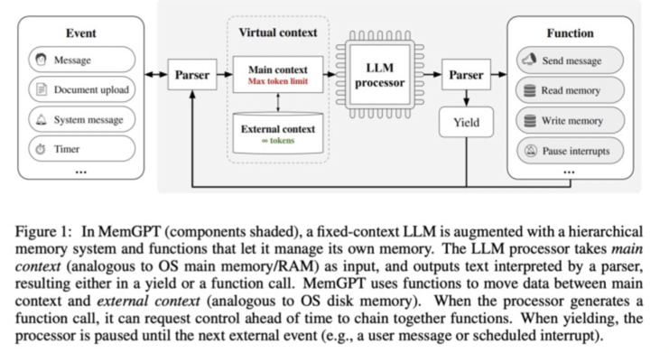
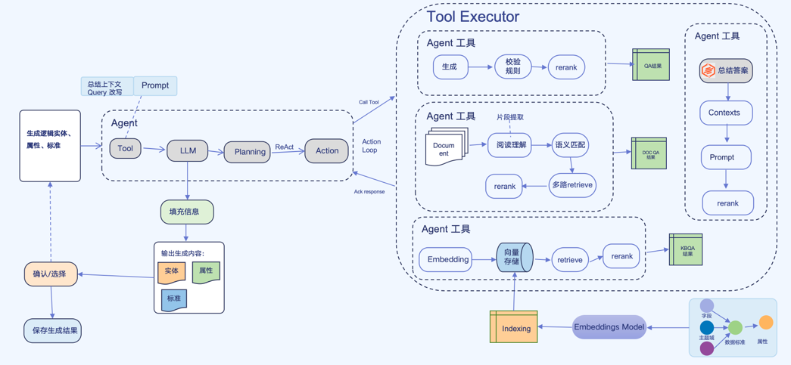

# Agent知识进阶

## 介绍

   早在 1950 年代，Alan Turing 就将「智能」的概念扩展到了人工实体，并提出了著名的图灵测试。这些人工智能实体通常被称为 —— 代理（Agent）。「代理」这一概念起源于哲学，描述了一种拥有欲望、信念、意图以及采取行动能力的实体。斯坦福大学的一篇名为《Generative Agents: Interactive Simulacra of Human Behavior,titled》的论文深入研究了记忆、反应和计划的AI Agent。


## 什么是Agent
   AI Agent 被认为是 OpenAI 发力的下一个方向。OpenAI 联合创始人 Andrej Karpathy 在近期的公开活动上说 “ 相比模型训练方法，OpenAI 内部目前更关注 Agent 领域的变化，每当有新的 AI Agents 论文出来的时候，内部都会很兴奋并且认真地讨论 ” 。

在人工智能领域，这一术语被赋予了一层新的含义：具有自主性、反应性、积极性和社交能力特征的智能实体。

AI Agent，它被设计为具有独立思考和行动能力的AI程序。你只需要提供一个目标，比如写一个游戏、开发一个网页，他就会根据环境的反应和独白的形式生成一个任务序列开始工作。就好像是人工智能可以自我提示反馈，不断发展和适应，以尽可能最好的方式来实现你给出的目标。



## 为什么需要AI Agent

   为什么大语言模型（LLM）刚流行不久，就需要AI Agent呢？LLM与LangChain 等工具相结合，释放了内容生成、编码和分析方面的多种可能性，目前在ChatGPT插件中比较有代表性的插件就是code interpreter。在这方面的应用上Agent的概念应用发挥着举足轻重的作用。

这里可以将Agent视为人工智能大脑，它使用LLM进行推理、计划和采取行动。

语言模型 (LLM) 仅限于它们所训练的知识，并且这些知识很快就会过时。（每天用最新信息重新训练这么大的模型是不可行的。）

- LLM的一些缺点

```
1、会产生幻觉。
2、结果并不总是真实的。
3、对时事的了解有限或一无所知。
4、很难应对复杂的计算。
```

这就是AI Agent的用武之地，它可以利用外部工具来克服这些限制。

这里的工具是什么呢？工具就是代理用它来完成特定任务的一个插件、一个集成API、一个代码库等等，例如：

```
1、Google搜索：获取最新信息
2、Python REPL：执行代码
3、Wolfram：进行复杂的计算
4、外部API：获取特定信息
```

## Agent的特点

AI Agent 能够做到以下几点：

- 自主性：Agent 可以根据环境的变化，做出自己的决策。

- 反应性：Agent 可以快速响应环境的变化，做出快速的决策。

- 积极性：Agent 可以主动探索新的环境，寻找新的知识。

- 社交能力：Agent 可以和其他 Agent 进行交流，学习和合作。

## Agent的功能

Agent 的功能可以分为以下几类：

- 决策：Agent 根据环境的输入，做出决策。

- 学习：Agent 学习环境的动态规划模型，提高决策的准确性。

- 交流：Agent 可以和其他 Agent 进行交流，学习和合作。

- 记忆：Agent 可以记住之前的经验，并在之后的决策中使用这些经验。

- 计划：Agent 可以根据环境的输入，制定计划，并执行计划。

- 反思：Agent 可以通过观察环境，分析环境，并思考环境。

- 控制：Agent 可以控制其他Agent，协同完成任务。

- 推理：Agent 可以利用外部工具来进行推理。

- 行动：Agent 可以执行任务，并输出结果。

- 奖励：Agent 可以根据任务的完成情况，给予奖励。

   

## Agent的架构

Agent 的架构可以分为以下几类：

- 基于规则的Agent：基于规则的Agent 按照一定的规则，做出决策。

   

- 基于模型的Agent：基于模型的Agent 学习环境的动态规划模型，做出决策。

-  交互式Agent：交互式Agent 可以与用户进行交互，获取用户的输入，做出决策。

   

- 多智能体Agent：多智能体Agent 可以同时控制多个Agent，协同完成任务。

   

- 多任务Agent：多任务Agent 可以同时完成多个任务，提高整体的效率。

  

- 强化学习Agent：强化学习Agent 学习环境的动态规划模型，通过与环境的交互，不断调整策略，使得策略能够更好地适应环境。

   

## Agent的状态存储（记忆）

在本文框架中，记忆模块（Memory）储存了代理过往的观察、思考和行动序列。通过特定的记忆机制，代理可以有效地反思并应用先前的策略，使其借鉴过去的经验来适应陌生的环境。

- 短期记忆：我认为所有的上下文学习（参见提示工程）都是利用模型的短期记忆来学习。

- 长期记忆：这为代理提供了长时间保留和回忆（无限）信息的能力，通常是通过利用外部向量存储和快速检索。

通常用于提升记忆能力的方法有四种：

- 扩展 Backbone 架构的长度限制：针对 Transformers 固有的序列长度限制问题进行改进。

- 总结记忆（Summarizing）：对记忆进行摘要总结，增强代理从记忆中提取关键细节的能力。

- 压缩记忆（Compressing）：通过使用向量或适当的数据结构对记忆进行压缩，可以提高记忆检索效率。

- 强化记忆（Reinforcement Learning）：引入类似计算机分层存储机制，强化记忆能力。

  

此外，记忆的检索方法也很重要，只有检索到合适的内容，代理才能够访问到最相关和准确的信息。


## 人类与AI的交互

人类与AI的交互可以分为以下几种：

- 文本交互：人类与AI进行文本交互，主要是通过文本聊天、语音交互等方式。

- 图像交互：人类与AI进行图像交互，主要是通过图像识别、图像生成等方式。

- 视频交互：人类与AI进行视频交互，主要是通过视频监控、视频生成等方式。

- 触觉交互：人类与AI进行触觉交互，主要是通过触觉控制、触觉识别等方式。

- 体感交互：人类与AI进行体感交互，主要是通过体感控制、体感识别等方式。

   


## Agent的训练

Agent的训练是指Agent根据环境的反馈，不断调整策略，使得策略能够更好地适应环境。训练可以分为两个阶段：

- 策略训练：Agent根据环境的反馈，调整策略参数，使得策略能够更好地适应环境。

- 值函数训练：Agent根据策略的表现，调整值函数参数，使得策略能够更好地预测未来奖励。

## Agent的部署

Agent的部署是指将训练好的Agent部署到实际的应用场景中，让Agent在实际的环境中运行。部署可以分为以下几个步骤：

- 环境搭建：搭建Agent运行的环境，包括环境的物理条件、Agent的初始状态、Agent的动作空间、Agent的观察空间等。

- Agent加载：加载训练好的Agent模型，包括策略模型和值函数模型。

- Agent运行：Agent根据环境的输入，执行动作，并接收环境的反馈。

- 结果评估：Agent根据环境的反馈，评估Agent的表现。

- 持续改进：根据Agent的表现，持续改进Agent的策略和值函数。

## 使用Agent注意的问题

- 稳定性问题

```
问题：
   1）LLM的输出不稳定，导致Agent执行过程的不稳定
   2）可能在某一个任务上陷入一个循环
描述：如果每个模块不稳定，难以开发成熟度高的 Agent应用，很难支持复杂任务。
解决方式：需要更强的底座模型，提升模型的稳定性，减少模型的不确定性。如：qianwen2.0-72B模型，支持多模态输入，支持多任务学习，支持多模态输出，支持多模态输入输出。
```

- 可用性问题

```
问题：
  1）Agent过长的prompt需求，带来很高的token消耗成本
  2）多Agent系统的token消耗更是惊人
描述：大模型调用成本过高，影响Agent的普及性。
解决方式：需要隆低大模型的推理成本，降低模型的调用成本。如：千问api降价、模型压缩、模型量化、模型加速等。
```

- 确定性问题

```
问题：Agent的输出不确定，导致任务失败或者更坏的结果
描述：在大模型幻觉问题没有解决前，是不可能让Agent去“接管〞世界的。
解决方式：通过强化学习、基于模型的Agent、多任务Agent等方法，提升Agent的确定性。
```

- 扩展性问题

```
问题：靠人力来写prompt，似乎是在重复符号主义AI的故事。
描述：通过人工编写prompt，却需要不断调优，像是走回了符号主义AI的老路。如：符号主义AI、专家系统、知识图谱。
解决方式：通过自动化的prompt生成工具，减少人工编写prompt的工作量，提升Agent的效率。如：大模型自动生成prompt、prompt-engineer、prompt-ops、prompt-ops-pro等。
```

## Agent 使用案例

  

## 总结

- 状态存储是Agent的一个重要功能，它可以帮助Agent记住之前的经验，并在之后的决策中使用这些经验。

- Agent的训练可以分为两个阶段：策略训练和值函数训练。

- Agent的部署可以分为几个步骤：环境搭建、Agent加载、Agent运行、结果评估、持续改进。

- 状态存储的实现方式有很多，常见的有基于记忆库的状态存储和基于模型的状态存储。

- 值函数训练可以帮助Agent更好地预测未来奖励。

- Agent的部署可以帮助Agent在实际的环境中运行，并持续改进策略和值函数。


## 后续更新

后续将会更新Agent的一些高级知识，包括Agent的强化学习、Agent的多智能体、Agent的多任务学习等。

## 参考资料

- [Reinforcement Learning: An Introduction](https://www.dropbox.com/s/b4879629962285/book2015oct.pdf?dl=0)
- [强化学习入门](https://morvanzhou.github.io/tutorials/machine-learning/reinforcement-learning/2-1-Q-Learning/)
- [强化学习算法汇总](https://zhuanlan.zhihu.com/p/26578694)
- [强化学习算法详解](https://zhuanlan.zhihu.com/p/26578694)
- [强化学习算法原理](https://zhuanlan.zhihu.com/p/26578694)
- [强化学习算法实践](https://zhuanlan.zhihu.com/p/26578694)
- [强化学习算法与应用](https://zhuanlan.zhihu.com/p/26578694)
- [Agent多智能体学习](https://zhuanlan.zhihu.com/p/26578694)
- [Agent多任务学习](https://zhuanlan.zhihu.com/p/26578694)
- [Agent的状态存储](https://zhuanlan.zhihu.com/p/26578694)
- [Agent的训练](https://zhuanlan.zhihu.com/p/26578694)
- [Agent的部署](https://zhuanlan.zhihu.com/p/26578694)
- [Agent的强化学习](https://zhuanlan.zhihu.com/p/26578694)

## 后续更新

本文档持续更新中，欢迎您持续关注，期待您的参与。


