# 构建知识图谱

[返回上级](./quick_start.md#知识图谱)

知识图谱可以应用在多个业务领域，如：生产域、研发域、营销域、文化域等。比如以文化域为例，为用户提供创建一个电影知识图谱的场景，用户可以将电影的相关信息（如电影名称、工作人员、类型、地区以及标签等）通过配置融合为一个知识图谱，配置完成后，用户可以通过对该电影知识图谱进行图分析来综合分析各信息项存在的关系。

构建一个电影图谱需要以下几个步骤：

    步骤1：准备工作
    步骤2：基本信息
    步骤3：选择数据源
    步骤4：创建本体
    步骤5：知识抽取
    步骤6：知识映射并生成知识图谱

## 步骤1：准备工作

用户在构建一个电影图谱之前，需要准备完成创建一个知识网络和数据源。创建知识网络步骤如下所示：

1. 登录KWeaver，点击“知识网络”，单击【新建】按钮，弹出“新建知识网络”对话框。

2. 在对话框内填入以下信息。

    |  参数  |  说明  |
    |  ---  |  ---  |
    |  名称  | 名称只由中英文、数字、特殊字符组成，长度为1-50位。 |
    |  颜色  | 选择新建知识网络的颜色。 |
    |  描述  | 描述只由中英文、数字、特殊字符组成，长度为0-200位。 |

3. 单击【确定】按钮，创建知识网络成功。

    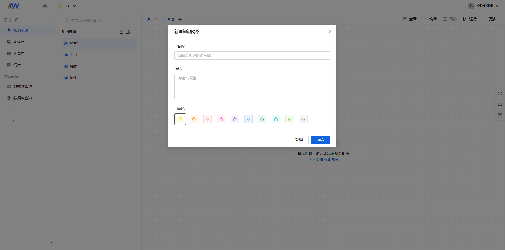

## 步骤2：基本信息

输入“知识图谱名称”——电影图谱，单击【下一步】按钮。
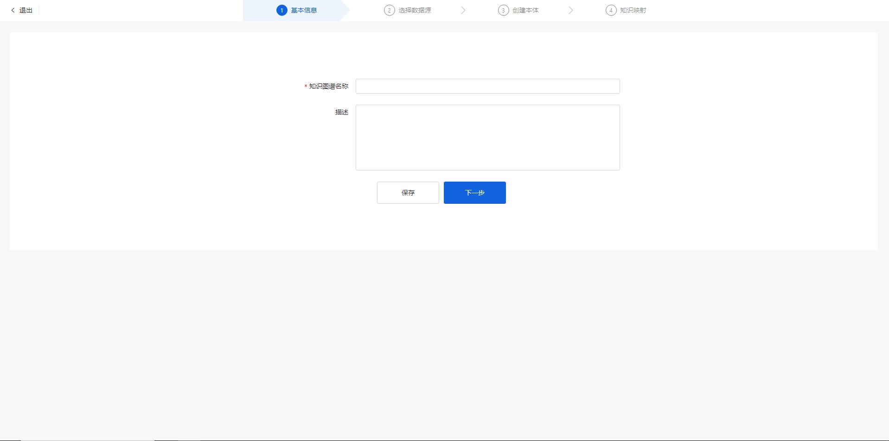

## 步骤3：选择数据源

选择将要使用的数据源。
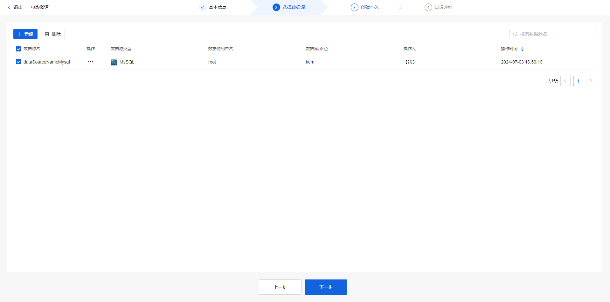

## 步骤4：创建本体

由于此次创建的实体类/关系类较多，我们可以选择批量导入实体类/批量创建关系类。

1. 在“批量导入实体类”对话框内选择对应数据表后单击【确定】按钮。

    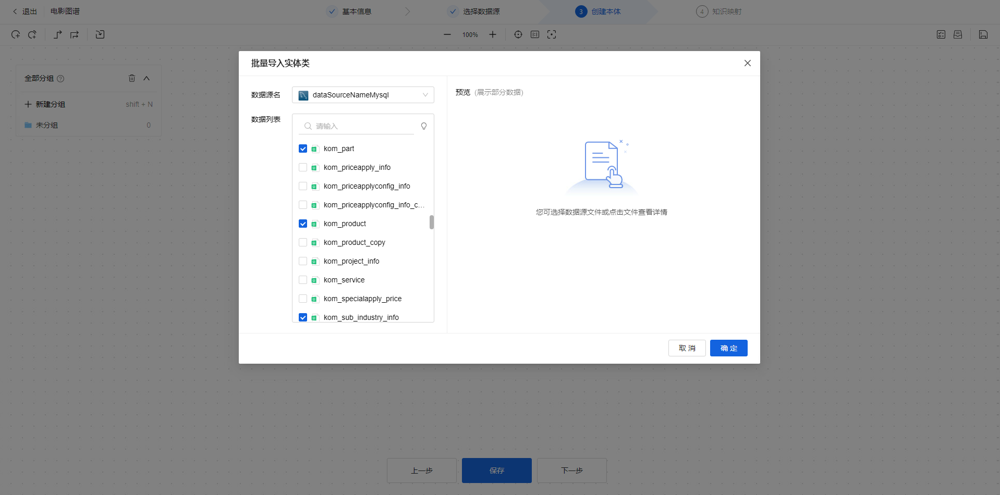

2. 成功导入的实体类会在画布上高亮显示，用户可以设置实体类的外观样式（颜色、图标等）、修改详情信息以及配置索引/融合属性。

    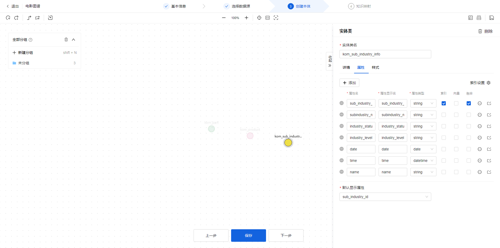

3. 创建实体类完成后，在画布顶部工具栏选择【批量关系类】按钮，在“批量关系类”对话框内选择起/终点，设置每一个关系类的显示名后单击【确定】按钮即可。

    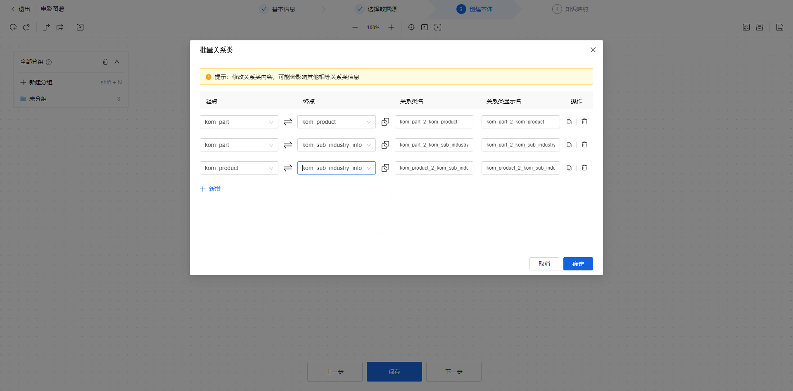

4. 下图是创建关系类完成后的效果图。此时，创建本体完成。

    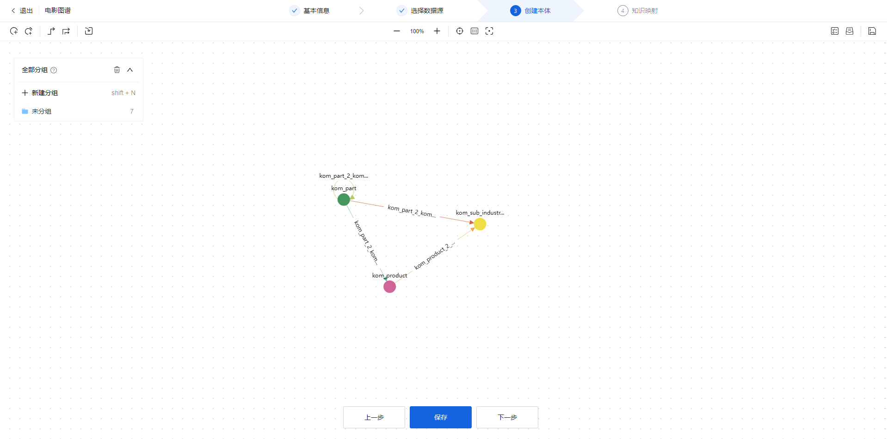

## 步骤5：知识映射

1. 添加所需抽取的数据表。

    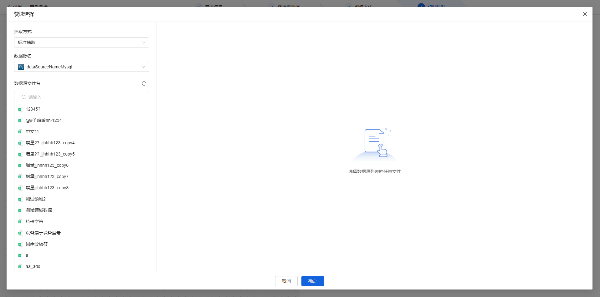
    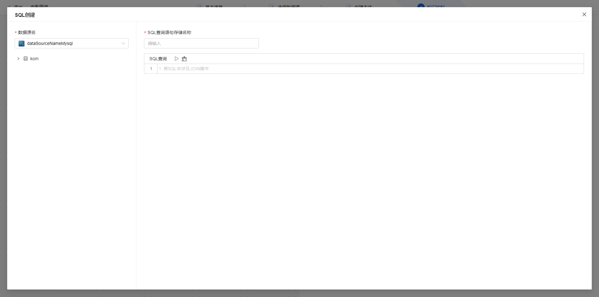

2. 配置实体类/关系类映射。

    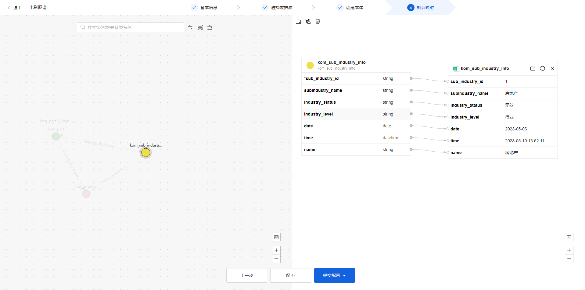

3. 在此我们以立即运行该图谱为例。单击【提交配置】>【立即运行】按钮，弹出“请选择构建知识图谱方式”对话框，更新方式选择【全量构建】。

    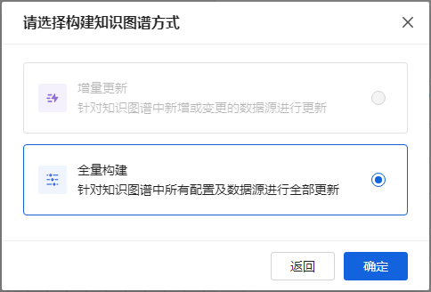

4. 构建完成后，我们可以单击【查看任务】按钮在图谱任务列表中查看到刚刚创建完成的图谱任务。

    

5. 下图为构建成功后的效果图，我们可以在画布上直观的看到每一个实体类的数量信息以及实体类间的关系。

    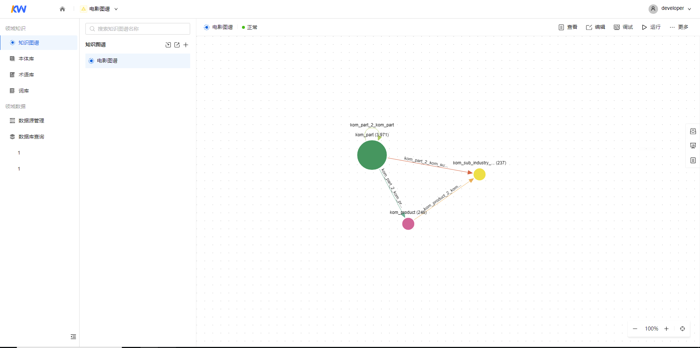
