# 模型工厂

[返回上级](./quick_start.md#模型工厂)

模型工厂基于大模型中立策略，让数据科学家能够快速接入各种大模型，通过提示词工程实现领域专业性和系统性的任务评估和优化。同时可以接入传统的机器学习和深度学习模型，提供模型使用的灵活性和多样性。

## 模型应用

### 简介

模型应用是将机器学习或人工智能模型部署到实际应用场景中，利用提示词微调等以解决特定问题或提供特定功能的过程。在模型应用中，开发人员或数据科学家将经过训练和优化的模型集成到现有的软件系统或服务中，使其能够自动地对输入数据进行预测、分类、识别等操作，并输出相应的结果。可以支持模型应用的创建、查看、编辑、移动、删除等功能。

### 定义

- 提示词：提示词是指在使用大语言模型进行对话或生成文本时，用户提供给模型的关键词或短语，用于引导模型生成与该提示相关的回答或文本。提示词可以帮助模型更好地理解用户的意图和上下文，并生成更准确、有针对性的回应。
- chat：使用场景中采用一问一答模式与用户持续对话。对话型提示词可以适用于不同的领域场景。可以帮助组织提高工作效率、减少人工成本和提供更好的用户体验。
- completion：是一种能够根据用户提供的提示，使大模型自动生成高质量文本的提示词。它可以生成各种类型的文本，例如文章摘要、翻译等。
- 对话开场白：设置对话开场白，在对话过程中让AI主动说第一段话可以拉近与用户间的距离。

### 操作指引（模型应用）

|  功能  |  说明  |  详细指导  |
|  ---  |  ---  |  ---  |
|  新建模型应用  | 添加提示词项目和分组，创建模型应用 |  [详情](./sub_quick_start/create_model_app.md)  |
|  查看模型应用  | 创建模型应用后，查看和调试预览提示词和模型效果 |  [详情](./sub_quick_start/view_model_app.md)  |
|  编辑模型应用  | 创建模型应用后，更新提示词、模型信息 |  [详情](./sub_quick_start/edit_model_app.md)  |
|  移动模型应用  | 移动模型应用的项目和分组满足业务需要 |  [详情](./sub_quick_start/move_model_app.md)  |
|  删除模型应用  | 删除已创建的模型应用，以适应业务变化 |  [详情](./sub_quick_start/delete_model_app.md)  |

## 提示词模板

### 概要说明

#### 提示词

提示词是一种自然语言指令，告诉大语言模型（LLM）执行什么任务。
通常：角色+角色技能+任务核心关键词+任务目标+任务背景+任务范围+ 任务解决与否判定+任务限制条件+输出格式/形式+输出量。

#### chat

使用场景中采用一问一答模式与用户持续对话。对话型提示词可以适用于不同的领域场景。可以帮助组织提高工作效率、减少人工成本和提供更好的用户体验。

#### completion

文本生成类应用是一种能够根据用户提供的提示，自动生成高质量文本的应用。它可以生成各种类型的文本，例如文章摘要、翻译等。

### 操作指引（提示词模板）

从“主页”进入"模型工厂"，在左侧菜单栏中选择“提示词模板”。

#### 新建提示词模板指引

##### 新建提示词模板一级分组

1. 进入模型工厂，在左侧菜单栏中选择“提示词模板”，进入“提示词模板“页面。

2. 单击【新建提示词模板分组】按钮，弹出“新建提示词项目”对话框。

    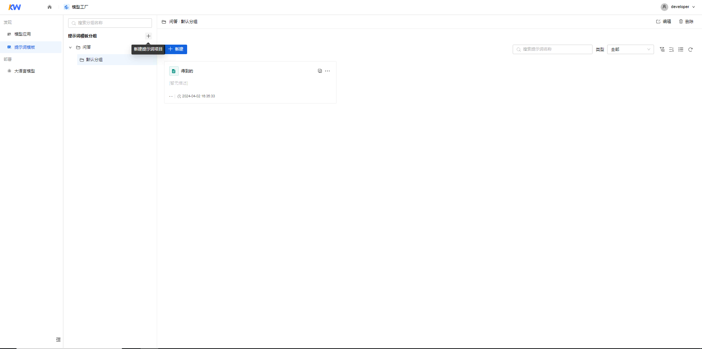
    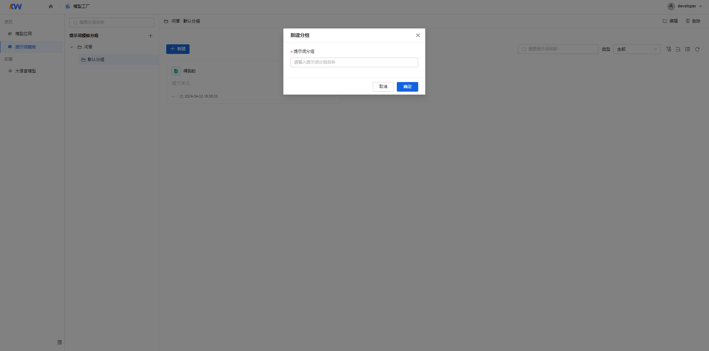
    填写如下信息：
    |  参数  |  说明  |
    |  ---  |  ---  |
    |  提示词模板分组名称  | 名称只能由大小写字母、数字、中文、特殊字符组成，长度为1-50位。|

3. 填完信息后，单击【确定】按钮。

    注意：

    新建提示词模板分组时，默认创建一个分组。

##### 编辑提示词模板一级分组

1. 选择提示词模板分组，单击“更多>编辑”按钮，弹出“编辑提示词模板分组”对话框。

    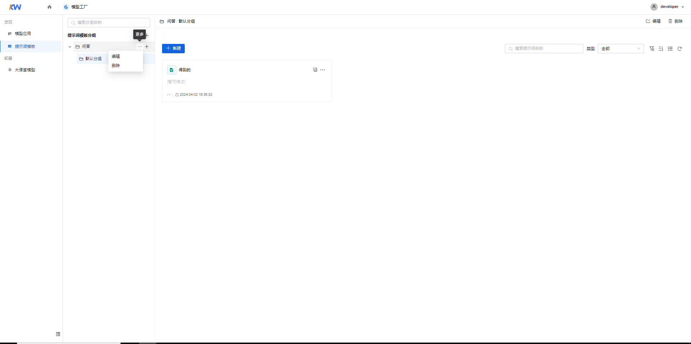

2. 在“编辑提示词模板分组”对话框中修改已创建的“提示词模板分组名称”，修改完成后单击【确定】按钮。

    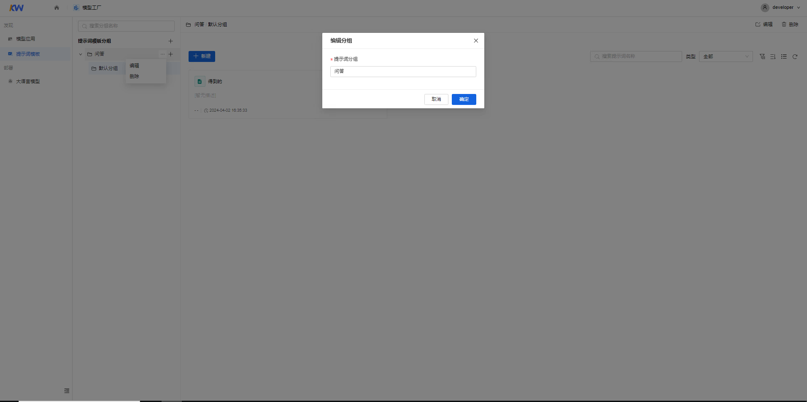

##### 删除提示词模板一级分组

1. 选择提示词模板分组，单击“更多>删除”按钮，弹出“删除提示词模板分组”对话框。

    

2. 在“删除提示词模板分组”对话框中输入“确定”以确认是否删除该提示词模板分组，单击【删除】按钮删除提示词模板分组。

    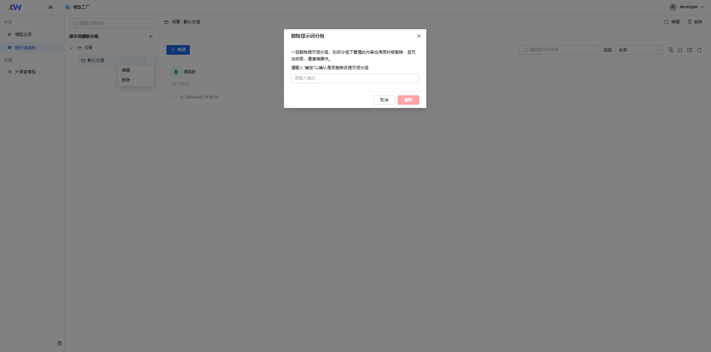

#### 提示词模板分组

##### 新建提示词模板分组

1. 选择提示词模板一级分组，单击【新建分组】，弹出“新建分组”对话框，可新建分组。

    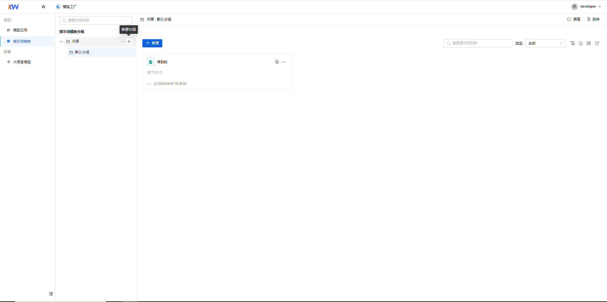
    
    填写如下信息：
    |  参数  |  说明  |
    |  ---  |  ---  |
    |  提示词模板分组名称  | 名称只能由大小写字母、数字、中文、特殊字符组成，长度为1-50位。|

2. 填完信息后，单击【确定】按钮。

##### 编辑提示词模板分组

1. 选择“提示词模板一级分组>提示词模板分组”，单击“更多>编辑”按钮，弹出“编辑分组”对话框。

    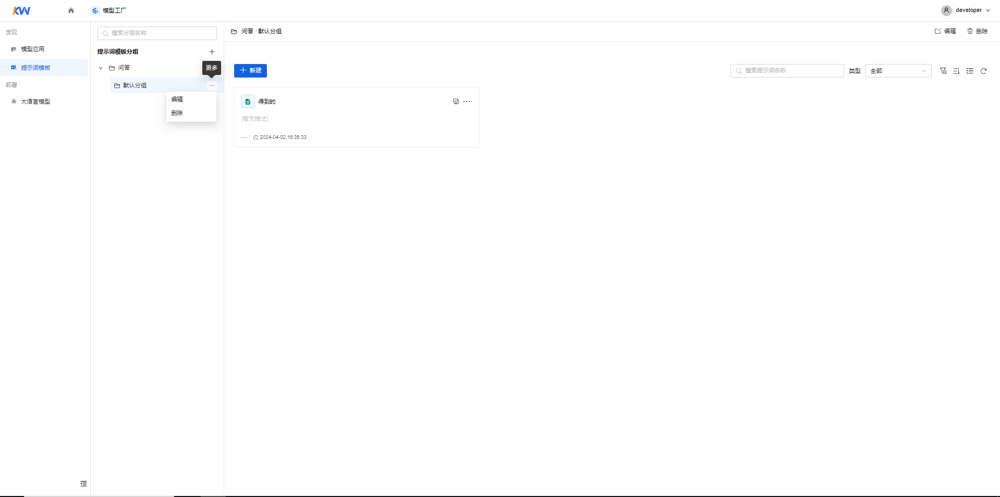

2. 在“编辑分组”对话框中修改已创建的“提示词模板分组名称”，修改完成后单击【确定】按钮。

    

##### 删除提示词模板分组

1. 选择“提示词模板一级分组>提示词模板分组”，单击“更多>删除”按钮，弹出“删除提示词模板分组”对话框。

    

2. 在“删除提示词模板分组”对话框中输入“确定”以确认是否删除该提示词模板分组，单击【删除】按钮删除提示词模板分组。

    

#### 新建提示词模板

1. 在分组页面中单击【新建】按钮，弹出“新建提示词”界面。

    
    填写如下信息：
    |  参数  |  说明  |
    |  ---  |  ---  |
    |  提示词模板名称  | 名称只能由中英文、数字和键盘上的特殊字符组成，长度为1-50位。|
    |  应用类型  | 支持用户选择completion或 chat|
    |  选择分组  | 支持用户对提示词分组进行切换|
    |  填写提示词  | 见下文|
    |  颜色  | 选择提示词图标颜色|
    |  提示词模板描述  | 描述只能由中英文、数字、特殊字符组成，长度为0-255位|

2. 填完信息后，单击【保存】按钮。

#### 填写提示词

##### 提示词输入

在“提示词”输入框中输入提示词，可以手动添加或单击【使用模版】按钮使用模版。

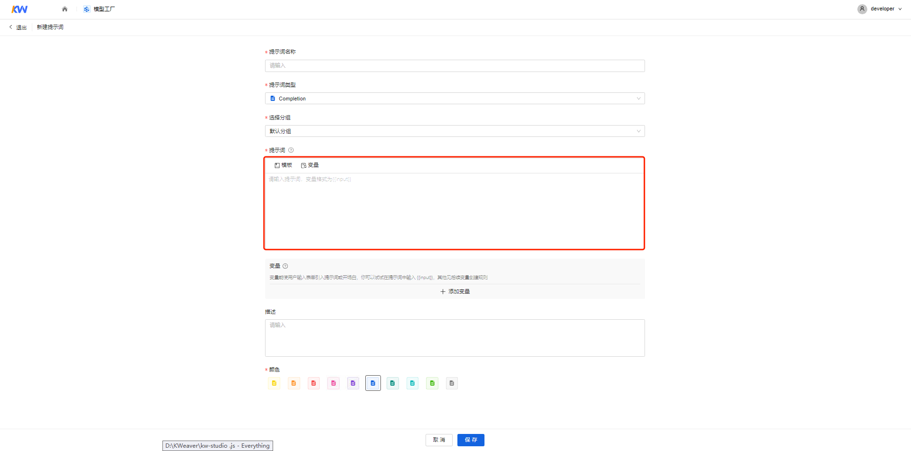
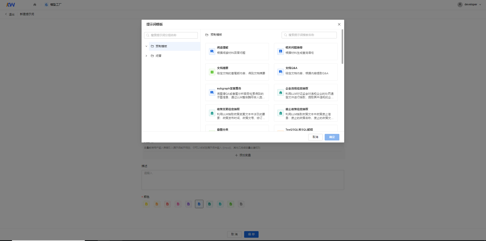

##### 变量管理

1. 添加变量

    方式一：“提示词”输入框中可以输入变量，例如{{output}}，单击【同步变量】按钮将输入的变量同步在下方变量表单中。

    

    方式二：您也可以在变量表单中单击【添加变量】按钮，添加变量。

    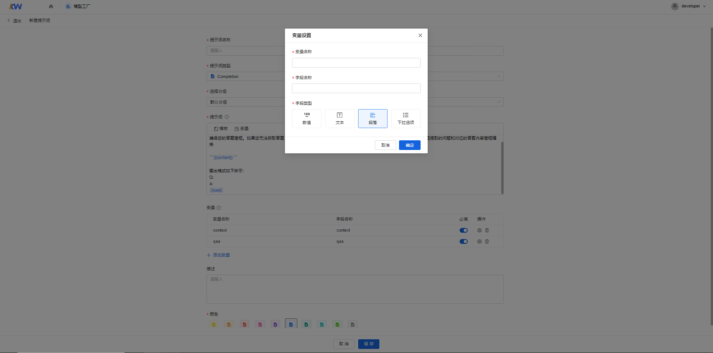

    填写如下信息。

    <table>
            <tr>
                <td>参数</td>
                <td>说明</td>
            </tr>
            <tr>
                <td>变量名称</td>
                <td>名称只能由大小写字母特殊字符组成，长度为1-50位，格式为{{input}}</td>
            </tr>
            <tr>
                <td>字段名称</td>
                <td>名称只能由中英文及特殊字符组成，长度为1-50位</td>
            </tr>
            <tr>
                <td rowspan="4">字段类型</td>
                <td>数值:支持用户输入整数和非整数。空值时最大值正无穷，最小值负无穷</td>
            </tr>
            <tr>
                <td>文本:默认值48，最大值256，最小值1</td>
            </tr>
            <tr>
                <td>段落:支持用户输入文本长度不限的段落文本</td>
            </tr>
            <tr>
                <td>下拉选项：需要至少有一个选项，选项内容不能为空，最长50字符</td>
            </tr>
        </table>

    单击【确定】按钮添加变量。

    注意：在变量表单中可以直接更改变量名称和字段名称，选择该变量是否为调试与预览的必填项。

    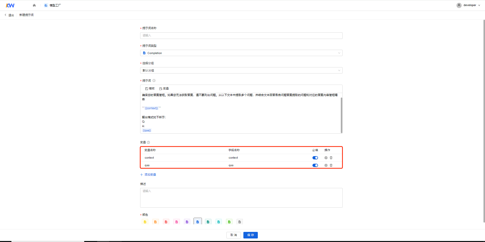

2. 变量配置

    单击“操作>变量设置”按钮，弹出“变量设置”对话框，对变量进行配置。

    

3. 删除变量

    单击“操作>删除”按钮，删除变量。

    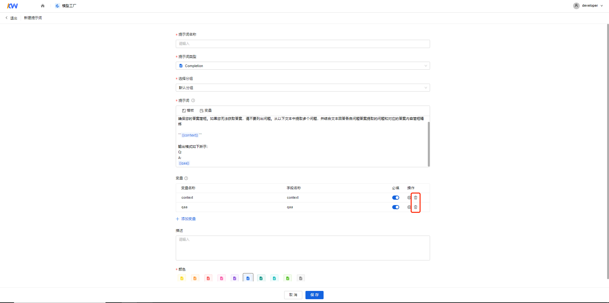

#### 查看提示词模板指引（参考“[查看模型应用](./sub_quick_start/view_model_app.md)”）

#### 编辑提示词模板指引（参考“[编辑模型应用](./sub_quick_start/edit_model_app.md)”）

#### 移动提示词模板指引（参考“[移动模型应用](./sub_quick_start/move_model_app.md)”）

#### 删除提示词模板指引（参考“[删除模型应用](./sub_quick_start/delete_model_app.md)”）

## 大语言模型

### 新建大语言模型

可以在模型工厂里的大语言模型界面新建大语言模型。

1. 进入模型工厂，在左侧菜单栏中选择“模型 > 大语言模型”，进入“大语言模型“页面。

2. 在大语言模型卡片模式中，单击【新建】按钮，弹出“接入模型”对话框。

    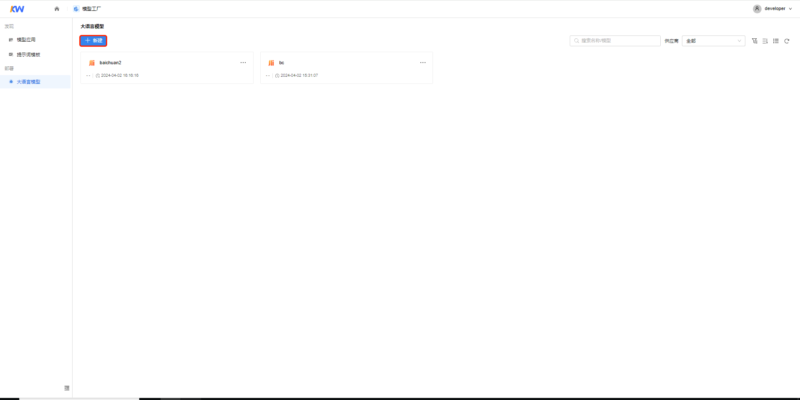
    
    填写如下信息：
    |  参数  |  说明  |
    |  ---  |  ---  |
    |  模型名称  | 名称只能由中英文、数字和键盘上的特殊字符组成，长度为1-50位。|
    |  供应商  | 供应商可选OpenAI、aishu-baichuan、aishu-qianwen  |
    |  API Model  | 模型服务的名称 组成：由英文、数字及键盘上的特殊字符号组成，长度为1-50位，且区分大小写|
    |  API Base  | API Base为请求地址 组成：由英文、数字及键盘上的特殊字符号组成，长度为1-150位。|
    |  API key  | 模型服务身份密码 组成：由英文、数字及键盘上的特殊字符号组成。|

3. 填完信息后，单击【测试连接】按钮对配置进行测试。

4. 测试连接成功后，单击【保存】按钮。

### 查看大语言模型

在“模型工厂>大语言模型>新建大语言模型”后，查看大语言模型信息。

1. 进入模型工厂，在左侧菜单栏中选择“模型 > 大语言模型”，进入“大语言模型“页面。

2. 在大语言模型卡片中，单击【查看】按钮，弹出“查看模型”对话框。

    

### 编辑大语言模型

在“模型工厂>大语言模型>新建大语言模型”后，编辑大语言模型信息。

1. 进入模型工厂，在左侧菜单栏中选择“模型 > 大语言模型”，进入“大语言模型“页面。

2. 在大语言模型卡片模式中，单击【编辑】按钮，弹出“编辑模型”对话框。详情见文档“[新建大语言模型](#新建大语言模型)”

    

### 测试大语言模型

在模型工厂>大模型接入>新建大语言模型后，测试大语言模型。

1. 进入模型工厂，在左侧菜单栏中选择“模型 > 大语言模型”，进入“大语言模型“页面。

2. 在大语言模型卡片中，单击【测试】按钮，测试连接配置。

    
