# completion

[返回上级](../create_model_app.md#应用类型)

创建文本生成型模型应用。

## 进入创建模型应用

1. 进入“模型工厂>模型应用“，选择模型应用分组后，在模型应用分组界面单击【新建】按钮，弹出“新建模型应用”对话框。

2. 在“新建模型应用”对话框中填写信息，选择文本生成型，详情见文档“[新建模型应用](../create_model_app.md)”。

   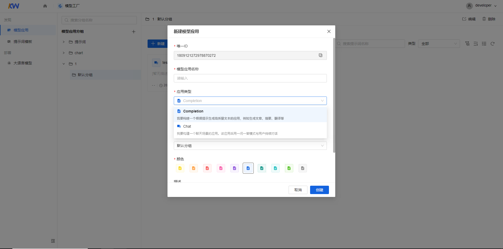

## 填写提示词

### 提示词输入

在“提示词输入框“中输入提示词，可以手动添加或单击【使用模版】按钮使用模版。

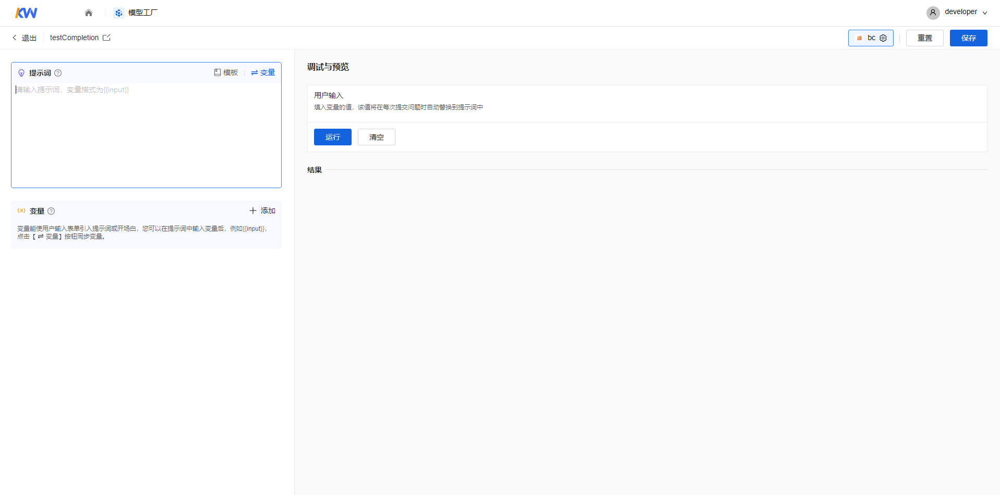

### 变量管理

1. 添加变量

    方式一：”提示词“输入框中输入变量，例如{{output}}，单击【同步变量】按钮将输入的变量同步在下方变量表单中。

    

    方式二：您也可以在变量表单中单击【添加】按钮，添加变量。

    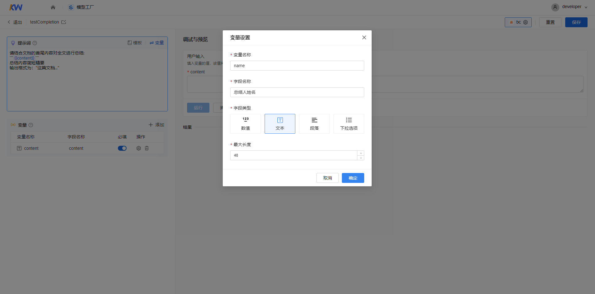

    填写如下信息：

    <table>
        <tr>
            <td>参数</td>
            <td>说明</td>
        </tr>
        <tr>
            <td>变量名称</td>
            <td>名称只能由大小写字母特殊字符组成，长度为1-50位，格式为{{input}}</td>
        </tr>
        <tr>
            <td>字段名称</td>
            <td>名称只能由中英文及特殊字符组成，长度为1-50位</td>
        </tr>
        <tr>
            <td rowspan="4">字段类型</td>
            <td>数值:支持用户输入整数和非整数。空值时最大值正无穷，最小值负无穷</td>
        </tr>
        <tr>
            <td>文本:默认值48，最大值256，最小值1</td>
        </tr>
        <tr>
            <td>段落:支持用户输入文本长度不限的段落文本</td>
        </tr>
        <tr>
            <td>下拉选项：需要至少有一个选项，选项内容不能为空，最长50字符</td>
        </tr>
    </table>

    单击【确定】按钮添加变量。

    注意：在变量表单中可以直接更改变量名称和字段名称，选择该变量是否为“调试与预览”的必填项。

2. 变量配置

    单击“操作>变量设置”按钮，弹出“变量设置”对话框，用户可对变量进行配置。

    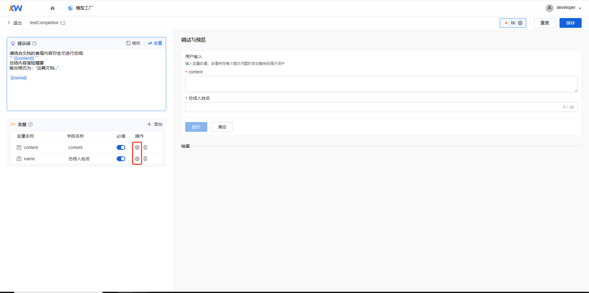

3. 删除变量

    单击“操作>删除”按钮，删除变量。

    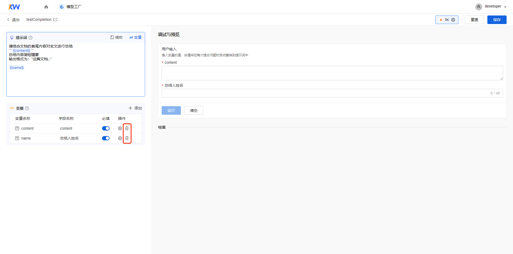

## 调试与预览

### 预览

1. 提示词中没有变量时，单击【运行】按钮，对提示词效果进行预览。

    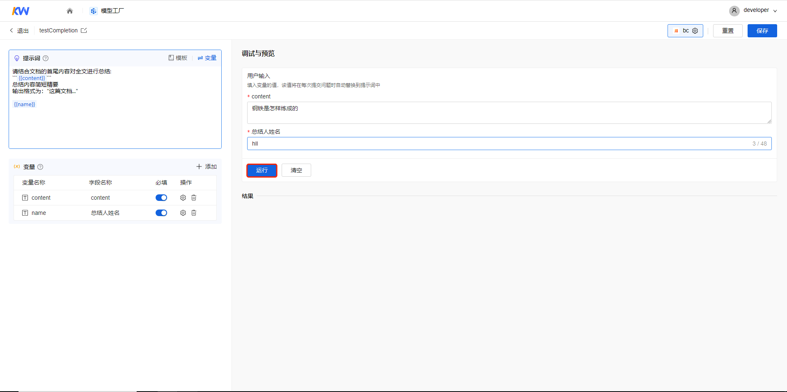

2. 提示词中存在变量时

    - 在调试与预览的“用户输入>变量”输入框中填入变量的值。

        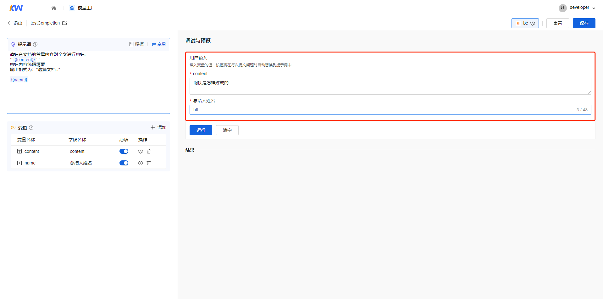

    - 单击【运行】按钮，该值将在每次提交问题时自动替换到提示词中，对提示词和变量效果进行预览。

        

    - 单击【运行】按钮后，结果生成等待时间过长，单击【停止响应】按钮停止生成，调整变量中的文本。

        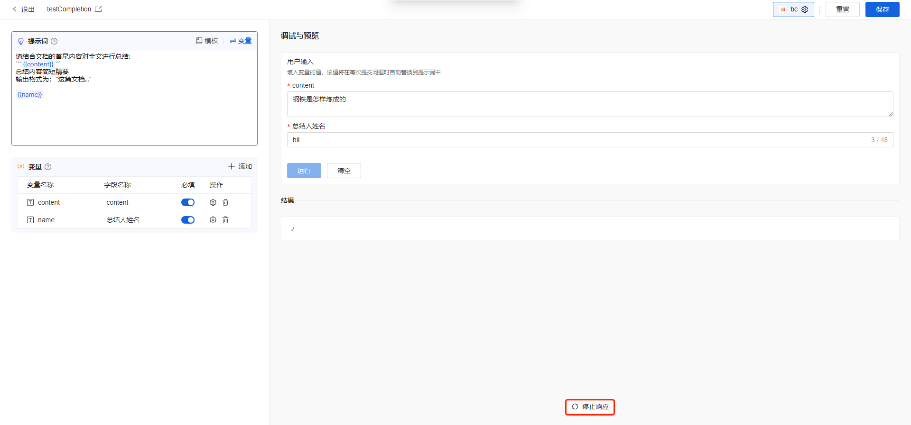

### 调试

在预览中对结果不满意，支持调整提示词和模型参数配置进行调试。单击【模型名称】按钮，弹出“配置模型和参数”对话框。

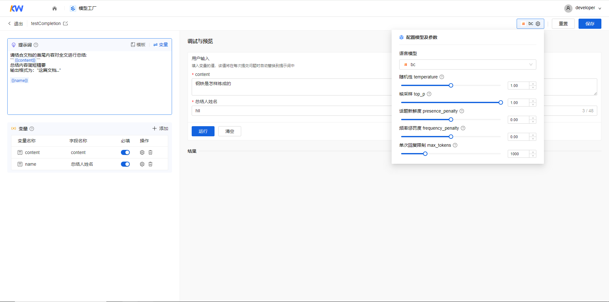

修改如下信息：

|  参数  |  说明  |
|  ---  |  ---  |
|  语言模型  |  支持用户在给定的语言模型中进行切换。  |
|  随机性  |  控制生成文本的随机性。这个参数可以控制生成文本的多样性，以避免生成过于相似的文本。默认值1，最大值2，最小值0 。  |
|  核采样  |  控制生成文本的概率阈值。这个参数可以控制生成文本的多样性，以避免生成过于相似的文本。默认值1，最大值1，最小值0。  |
|  话题新鲜度  |  控制生成文本的存在惩罚。这个参数可以控制生成文本中不存在的单词和短语的数量，以避免生成过于不连贯的文本。默认值0，最大值2，最小值-2。  |
|  频率惩罚度  |  控制生成文本的频率惩罚。这个参数可以控制生成文本中重复的单词和短语的数量，以避免生成过于重复的文本。默认值0，最大值2，最小值-2。  |
|  单次回复限制  |  控制生成文本的最大长度。这个参数可以控制生成文本的长度，以避免生成过长的文本。默认值16，最大值随模型变动调整，最小值10。 注意： 用户设置的最大单次回复限制数值如果较大，可能会导致 prompt、用户问题、知识库内容没有token 空问进行处理，建议设置到 2/3以下。  |

### 重新开始

调试时在“调试与预览”的“用户输入>变量”输入框中修改变量或“配置模型与参数”后，单击【清空】按钮，重新对修改内容的效果进行预览。

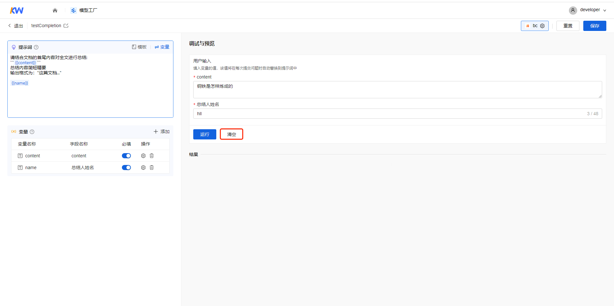

### 重置

调试时可以单击【重置】按钮，将提示词、变量清单和调试与预览清空。

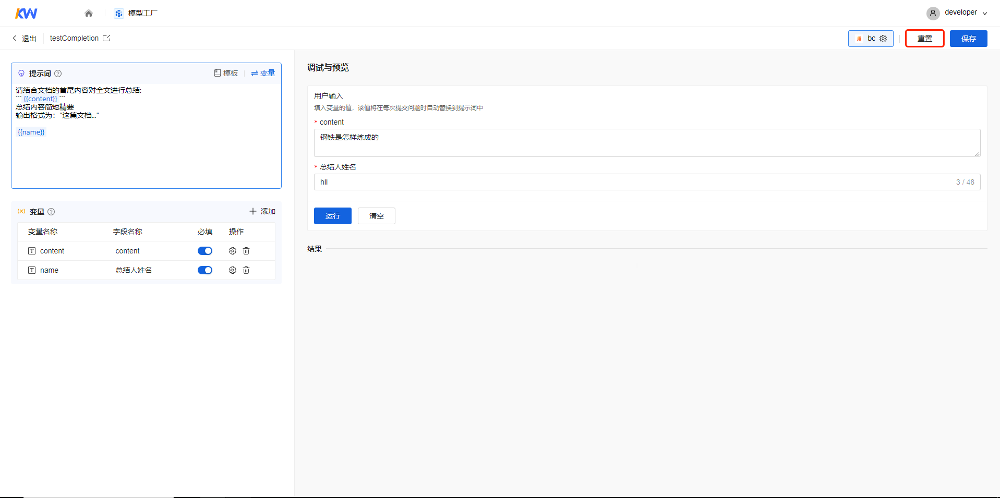

## 保存

在调试与预览后，单击【保存】按钮，对提示词进行保存。

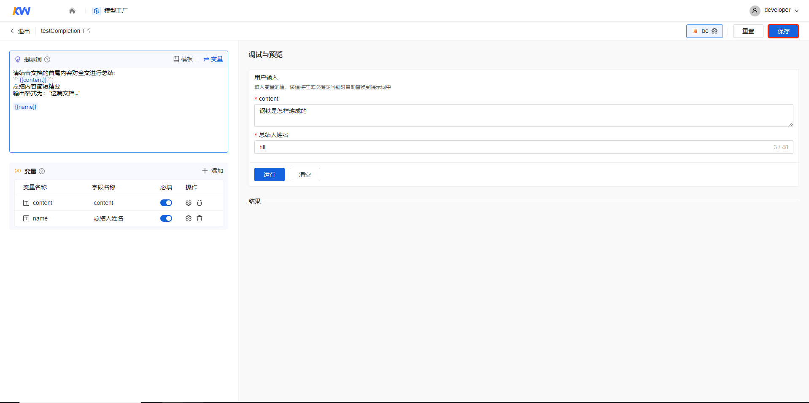
