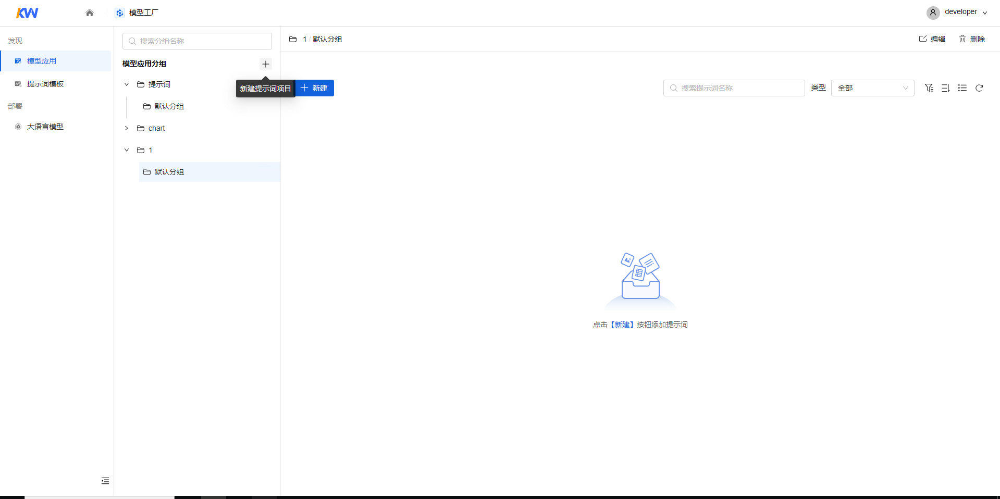
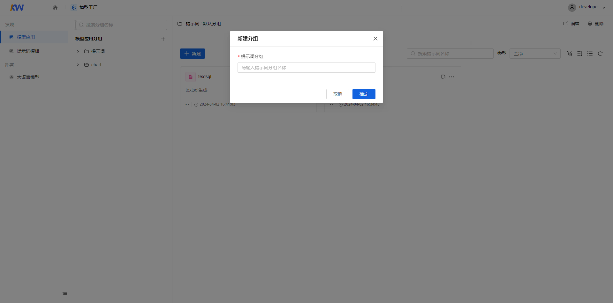
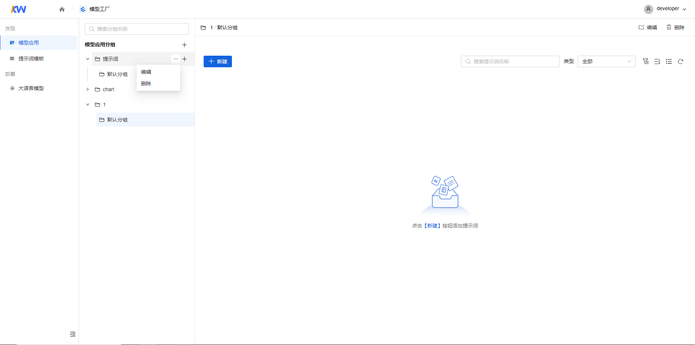
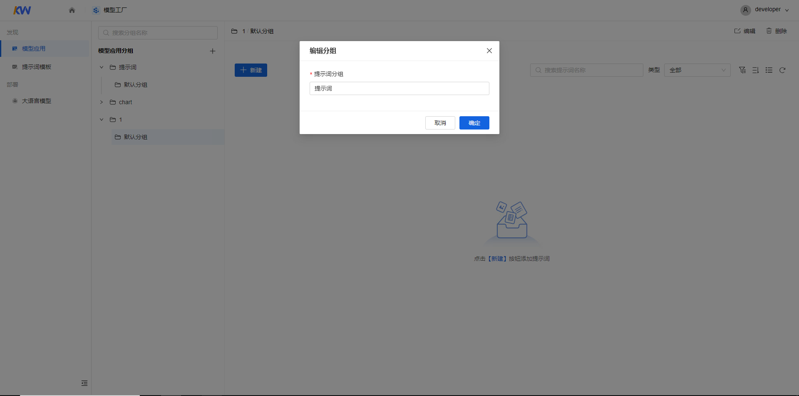
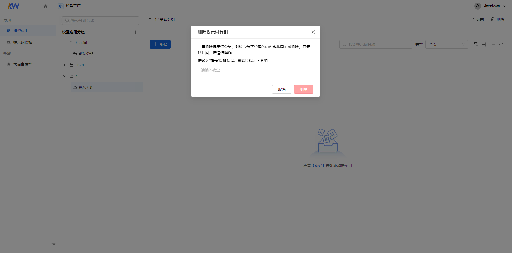
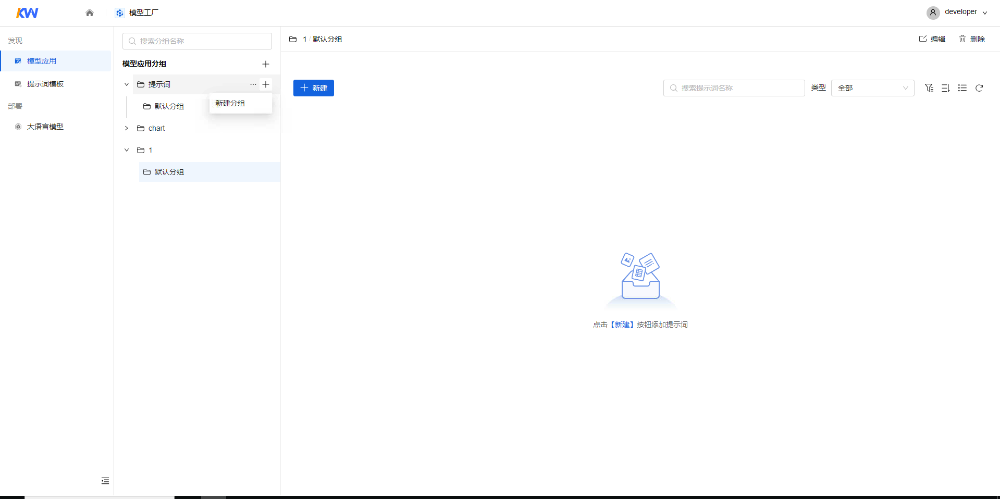
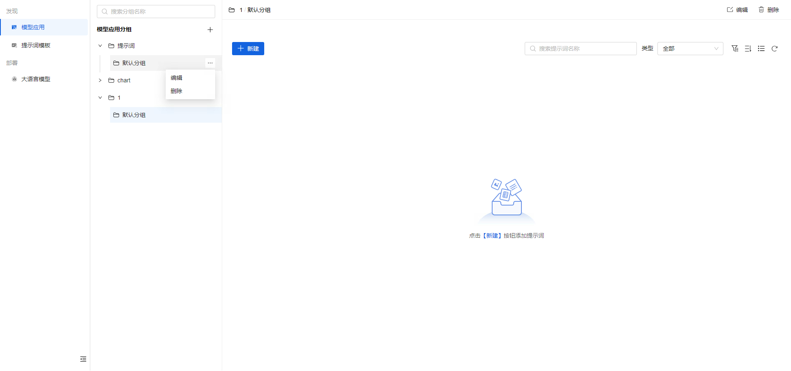
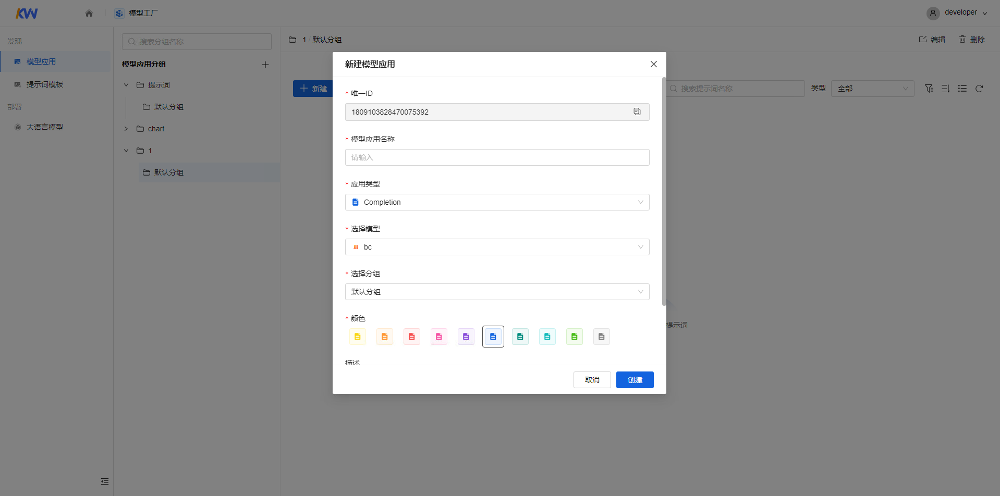

# 新建模型应用（操作指引）

[返回上级](../quick_start_mf.md#操作指引)

添加模型应用项目和分组，创建模型应用。

## 模型应用一级分组

### 新建模型应用分组（一级）

1. 进入模型工厂，在左侧菜单栏中选择“模型应用”，进入“模型应用“页面。

2. 单击【新建模型应用分组】按钮，弹出“新建提示词分组”对话框。

    
    
    填写如下信息：
    |  参数  |  说明  |
    |  ---  |  ---  |
    |  模型应用分组名称  |  名称只能由大小写字母、数字、中文、特殊字符组成，长度为1-50位。  |

3. 填完信息后，单击【确定】按钮。

注意：

新建模型应用分组时，默认创建一个分组。

### 编辑提示词项目（一级）

1. 选择模型应用分组，单击“更多>编辑”按钮，弹出“编辑模型应用分组”对话框。

    
2. 在“编辑模型应用分组”对话框中修改已创建的“模型应用分组名称”，修改完成后单击【确定】按钮。

    

### 删除模型应用分组（一级）

1. 选择模型应用分组，单击“更多>删除”按钮，弹出“删除模型应用分组”对话框。

    
2. 在“删除模型应用分组”对话框中输入“确定”以确认是否删除该模型应用分组，单击【删除】按钮删除模型应用分组。

    

## 模型应用分组

### 新建模型应用分组

1. 选择模型应用一级分组，单击【新建分组】，弹出“新建分组”对话框，可新建分组。

    
    填写如下信息：
    |  参数  |  说明  |
    |  ---  |  ---  |
    |  模型应用分组名称  |  名称只能由大小写字母、数字、中文、特殊字符组成，长度为1-50位。  |

2. 填完信息后，单击【确定】按钮。

### 编辑模型应用分组

1. 选择“模型应用一级项目>模型应用分组”，单击“更多>编辑”按钮，弹出“编辑分组”对话框。

    

2. 在“编辑分组”对话框中修改已创建的“模型应用名称”，修改完成后单击【确定】按钮。

    

### 删除模型应用分组

1. 选择“模型应用一级分组>模型应用分组”，单击“更多>删除”按钮，弹出“删除模型应用分组”对话框。

    

2. 在“删除模型应用分组”对话框中输入“确定”以确认是否删除该模型应用分组，单击【删除】按钮删除模型应用分组。

    

## 新建模型应用

1. 在分组页面中单击【新建】按钮，弹出“新建模型应用”对话框。

    
    填写如下信息：
    |  参数  |  说明  |
    |  ---  |  ---  |
    |  唯一ID  |  默认生成一个19位字符的ID，可支持修改 ID只能由大小写字母、数字以及下划线组成，长度1-20位，不可重复 单击【切换】按钮可以切换回默认生成的ID  |
    |  选择分组  |  支持用户对提示词分组进行切换  |
    |  模型应用名称  |  名称只能由中英文、数字和键盘上的特殊字符组成，长度为1-50位  |
    |  应用类型  |  支持用户选择completion或 chat  |
    |  选择模型  |  选择提示词使用的模型  |
    |  颜色  |  选择提示词图标颜色  |
    |  模型应用描述  |  描述只能由中英文、数字、特殊字符组成，长度为0-255位  |

2. 填完信息后，单击【创建】按钮。进入对应的模型应用界面。

### 应用类型

|  类型  |  详细指导  |
|  ---  |  ---  |
|  chat  |  [详情](./app_type/chat.md)  |
|  completion  |  [详情](./app_type/completion.md)  |
