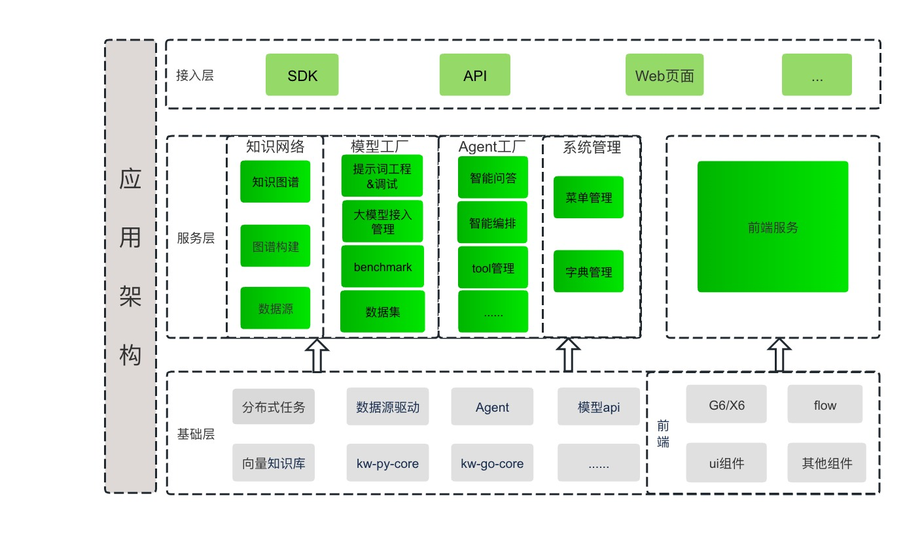
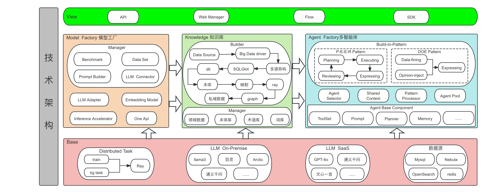

# KWeaver 架构介绍

KWeaver 是一个基于 Python 的开源项目，用于快速构建和部署机器学习模型。KWeaver 由以下几个主要组件构成：

- **KWeaver 服务器** ：KWeaver 服务器是一个基于 Python 的 Web 应用，用于管理机器学习模型的生命周期。它可以用来创建、训练、评估、部署和管理模型。
- **KWeaver 引擎** ：KWeaver 引擎是一个基于 Python 的库，用于构建、训练和部署机器学习模型。它可以用来构建、训练和部署模型，并提供模型评估和管理功能。
- **KWeaver 平台** ：KWeaver 平台是一个基于 Python 的 Web 应用，用于管理机器学习模型的生命周期。它可以用来创建、训练、评估、部署和管理模型。
- KWeaver 服务器和 KWeaver 平台可以部署在同一台服务器上，也可以部署在不同的服务器上。KWeaver 引擎可以部署在本地机器上，也可以部署在远程服务器上。

应用架构如下图所示：

技术架构如下图所示：

- 知识图谱多源异构融合：KWeaver 引擎支持多源异构知识图谱，不同数据源可以来自不同的数据库多任务、多领域、多语言。KWeaver 引擎可以将不同数据源的知识图谱融合到一起，形成统一的知识图谱。
- Agent多智能体：KWeaver 引擎支持多种类型的智能体，包括基于规则的智能体、基于深度学习的智能体、基于强化学习的智能体等。智能体可以根据业务需求进行定制化开发。
- 数据集管理：KWeaver 服务器支持数据集管理，用户可以上传、下载、管理数据集。数据集可以用于训练、评估和部署模型。
- Benchmark评测工具：KWeaver 服务器支持Benchmark评测工具，用户可以对模型进行评测，并获取模型的性能指标。
- 图谱构建工具：KWeaver 服务器支持图谱构建工具，用户可以构建知识图谱，并将其导入到 KWeaver 引擎中。
- 任务调度中心：KWeaver 服务器支持任务调度中心，用户可以创建、管理任务，并将任务分配给不同的智能体。

更新中，敬请期待。。。
